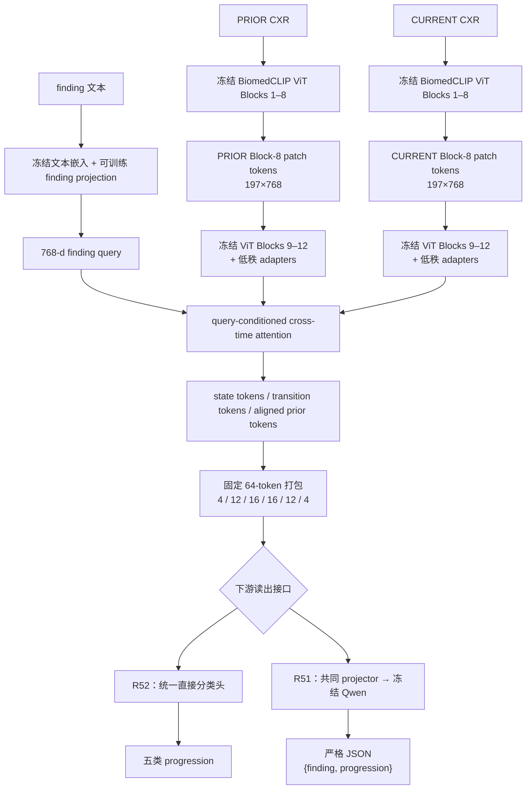
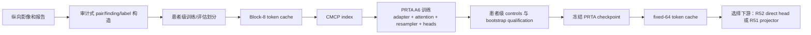

# PRTA-CXR / TIER-CXR-VLM：论文方法学、模型架构与端到端 Pipeline 详解

> 文档目的：从论文作者和审稿人的视角，完整解释当前 PRTA-CXR 方法到底解决什么问题、网络如何搭建、训练数据如何流动、64-token 如何形成，以及模型如何以独立分类器或冻结 VLM 方式部署。
>
> 方法版本：PRTA-CXR R37.1 A6 + fixed-64 interface + TIER-CXR-VLM / PRTA-Gen readout
>
> 本文不把 R51、R52 当成两套不同的主方法；它们是同一 PRTA 表征的两种下游读出接口。

## 1. 论文要解决的问题

### 1.1 输入不是一张片，而是一个“有问题的时间对”

每个样本由三部分组成：

1. `PRIOR`：患者较早时间点的胸部 X 光片；
2. `CURRENT`：同一患者较晚时间点的胸部 X 光片；
3. `finding query`：要求模型判断的具体影像学 finding，例如 `Pleural Effusion` 或 `Edema`。

目标不是判断 CURRENT 图像上有没有 finding，而是判断该 finding 从 PRIOR 到 CURRENT 的变化方向：

| progression 类别 | 含义 |
|---|---|
| `Stable` | finding 基本未变 |
| `Improved` | finding 仍存在，但减轻 |
| `Worse` | finding 仍存在，但加重 |
| `New` | CURRENT 新出现 |
| `Resolved` | PRIOR 存在、CURRENT 消失或基本消退 |

因此，正确的算法必须同时具备三种能力：

- 理解每个时间点的影像状态；
- 知道 PRIOR 与 CURRENT 的相应局部区域如何对应；
- 让“改善”和“恶化”、“新发”和“消退”具有明确的时间方向，而不是只检测“两个时间点不同”。

### 1.2 直接拼接两张图为什么不够

若把两张完整胸片直接送入一个 VLM，或者把两组 patch token 简单串联，模型需要自行完成四件事：找到与 finding 有关的区域、建立跨时间对应、区分方向和组织结果。对小数据或冻结视觉主干而言，这会把最关键的时间结构交给下游模型猜测。

PRTA 的核心立场是：

> 不把时间变化当成两个全局表征相减，而是在视觉 token 层显式构造 finding 条件化、方向敏感、可压缩的跨时间关系表示。

这也是 PRTA 与“prior/current 拼接 + 分类头”或“raw two-image VLM”的根本差异。

---

## 2. 方法总览



可以把整个方法分为四层：

| 层 | 组件 | 作用 |
|---|---|---|
| L1：医学视觉底座 | BiomedCLIP ViT | 提取每个图像的医学 patch token |
| L2：时间表征学习 | PRTA temporal adapter | 对齐 prior/current，并生成 state 与 transition 表示 |
| L3：固定视觉接口 | 64-token packer | 把可变/丰富的时间表征压缩为固定预算 |
| L4：读出器 | direct head 或 frozen Qwen | 将表征变为五类标签或结构化 JSON |

论文的主要创新位于 L2 和 L3；L4 用于检验该视觉表征是否能被不同类型的下游系统读取。

---

## 3. 符号、张量与任务定义

对批大小为 \(B\) 的样本，定义：

| 符号 | 形状 | 含义 |
|---|---|---|
| \(I^p\) | 图像 | PRIOR 胸片 |
| \(I^c\) | 图像 | CURRENT 胸片 |
| \(f\) | 字符串 | finding 名称 |
| \(q_f\) | \(\mathbb{R}^{768}\) | finding 条件向量 |
| \(X^p_8,X^c_8\) | \(\mathbb{R}^{B\times197\times768}\) | Block-8 token cache |
| \(P,C\) | \(\mathbb{R}^{B\times197\times768}\) | 经过 PRTA frozen-tail adapters 后的 prior/current token |
| \(A\) | \(\mathbb{R}^{B\times197\times768}\) | 被 CURRENT 条件化后的 aligned prior token |
| \(S\) | \(\mathbb{R}^{B\times20\times768}\) | state resampler 输出 |
| \(T\) | \(\mathbb{R}^{B\times20\times768}\) | transition resampler 输出 |
| \(Z\) | \(\mathbb{R}^{B\times64\times768}\) | 最终 fixed-64 token bundle |
| \(y\) | \(\{0,1,2,3,4\}\) | 五类 progression 标签 |

五类索引顺序固定为：

```text
0 Stable
1 Improved
2 Worse
3 New
4 Resolved
```

时间反转下的标签置换为：

\[
\pi(\text{Stable})=\text{Stable},\quad
\pi(\text{Improved})=\text{Worse},\quad
\pi(\text{Worse})=\text{Improved},
\]

\[
\pi(\text{New})=\text{Resolved},\quad
\pi(\text{Resolved})=\text{New}.
\]

这一定义把 temporal direction 变成可检验的群作用，而不是一句口头上的“模型应当理解时间”。

---

## 4. 数据与监督 Pipeline

## 4.1 训练数据的基本单位

训练不是把报告文本直接交给模型推理。报告只用于离线构造可审计的 progression supervision；模型在评估和部署时只读取图像与 finding query。

每条训练样本包括：

```text
patient_id
prior study / prior DICOM / prior image path
current study / current DICOM / current image path
interval_days
finding
progression label
optional CMCP counterfactual prior reference
```

所有划分以患者为单位。一个患者的图像、study 和 pair 不能同时出现在训练和评估分区中。

## 4.2 纵向 pair 的形成

数据构造遵循如下顺序：

1. 在官方训练 split 中筛选患者；
2. 先排除所有冻结的禁止患者集合；
3. 每个 study 只保留一张 frontal 图像，优先 PA，其次 AP；
4. 要求图像与相应报告均存在；
5. 按患者、日期、时间、study ID、DICOM ID 稳定排序；
6. 只将相邻合格 study 配成时间对；
7. 排除同日 pair 与非正间隔；
8. 记录 view 和间隔，避免把采集条件完全不同的记录悄然混成同一分布。

这种约束的目的不是追求“尽可能多 pair”，而是让 prior/current 的时间顺序可追溯。

## 4.3 finding-level progression 标签

标签来自 CURRENT 报告中 finding 与明确时间方向短语的同句或同 clause 共现。例如：

| 类别 | 允许的方向性语言示例 |
|---|---|
| New | new、newly developed、interval development |
| Resolved | resolved、no longer seen、cleared、disappeared |
| Improved | improved、decreased、less、resolving |
| Worse | worsened、increased、more prominent、progressed |
| Stable | stable、unchanged、similar、no significant interval change |

构造器拒绝不确定语气、否定、问题式陈述、模糊横向比较、finding 冲突和无法明确归属的短语。对可映射至 CheXpert observation 的 `New/Resolved`，还使用 prior/current 状态变化作一致性检查。

关键点是：**报告是训练监督来源，不是部署输入。** 这使方法仍是影像驱动的 longitudinal representation learner，而不是报告复述器。

## 4.4 Current-Matched Counterfactual Prior（CMCP）

CMCP 是 PRTA 的重要训练控制。对某个真实样本 \((I^p,I^c,f,y)\)，构造一个反事实对：

\[
(\widetilde I^p,I^c,f,y),
\]

其中 \(\widetilde I^p\) 来自另一患者，但要满足：

- finding 相同；
- CURRENT view 相同；
- transition class 不同；
- 属于同一训练分区；
- 不来自任何受保护患者。

候选按与目标 CURRENT 的 Block-8 mean-pooled token cosine similarity 排序，取最高的合格候选。因此，CMCP 尽量保持 CURRENT 图像和静态外观相似，只替换 prior。它迫使模型不能仅凭 CURRENT 或患者无关的全局外观猜测类别。

---

## 5. L1：冻结 BiomedCLIP 中间 patch 特征

## 5.1 为什么使用中间层而不是只用最终 CLS

最终 CLS 向量适合全局图像语义，但纵向 progression 往往依赖局部病灶、边界、密度变化和跨时间空间对应。PRTA 因此从 ViT 的 Block 8 后缓存 token，而不是只从最终层抽取一个全局向量。

对每张图像，缓存：

\[
X_8\in\mathbb{R}^{197\times768}.
\]

197 个 token 包含 1 个 CLS 和 196 个视觉 patch token。缓存使用 FP16 以节约存储，但进入 PRTA 训练时转换为 FP32。

## 5.2 冻结边界

BiomedCLIP 的：

- patch embedding；
- position embedding；
- ViT Blocks 1–8；
- Blocks 9–12 的原始基础参数；
- final normalization 的原始基础参数；

都不更新。Block 8 的缓存可以被不同 seed、不同控制臂和下游读出重复使用，从而避免重复编码带来的随机性与计算浪费。

这让 PRTA 的可训练部分专注于“如何组织时间关系”，而不通过全面微调底座去记忆训练 cohort。

---

## 6. L2：PRTA Temporal Adapter

## 6.1 Frozen tail + Bottleneck Adapters

Block 8 后的 token 继续通过原始 ViT Blocks 9–12，但在每个 frozen block 后插入一个低秩 bottleneck adapter。

单个 adapter 的输入为 \(x\in\mathbb{R}^{768}\)：

\[
\operatorname{Adapter}(x)=x+s\cdot W_{up}\operatorname{GELU}(W_{down}\operatorname{LN}(x)),
\]

其中：

- \(W_{down}:768\rightarrow32\)；
- \(W_{up}:32\rightarrow768\)；
- \(s\) 是初始化为 \(10^{-3}\) 的可训练缩放参数；
- `up` 权重零初始化，使训练一开始接近冻结主干；
- 正式 A6 使用 rank 32、dropout 0。

```text
Block-8 token
    ↓
Frozen ViT Block 9 → rank-32 adapter
    ↓
Frozen ViT Block 10 → rank-32 adapter
    ↓
Frozen ViT Block 11 → rank-32 adapter
    ↓
Frozen ViT Block 12 → rank-32 adapter
    ↓
adapted 197×768 token sequence
```

两张图共享这套 frozen-tail 和 adapter 权重。也就是说，PRIOR 与 CURRENT 不各自拥有一个网络；它们首先被同一个医学视觉变换处理，再在时间关系模块中交互。

## 6.2 finding query

finding 文本先由冻结文本缓存给出 embedding，再经过一个可训练投影：

\[
q_f=\operatorname{MLP}_{finding}(e_f)\in\mathbb{R}^{768}.
\]

该投影由 LayerNorm、Linear、GELU、Linear 组成。它使 finding 文本进入与视觉 token 同一宽度的空间。

finding query 的作用不是把类别标签泄露给模型，而是指定当前问题的关注对象：同一对胸片在回答 `Edema` 与 `Pleural Effusion` 时，应该检索和比较不同区域及不同变化模式。

## 6.3 Query-conditioned cross-time alignment

经过 frozen tail + adapters 后得到 PRIOR token \(P\) 和 CURRENT token \(C\)。先给两者加入 query 条件：

\[
C_f=C+q_f,\qquad P_f=P+q_f.
\]

然后使用多头交叉注意力：

\[
A=\operatorname{MHA}(Q=\operatorname{LN}(C_f),K=\operatorname{LN}(P_f),V=\operatorname{LN}(P)).
\]

这里的输出 \(A\) 可理解为：对于每个 CURRENT token，模型在 PRIOR 中检索并聚合与其最相关的历史证据。与仅按同一 patch 索引相减不同，attention 可以在时间点间轻微位移、构图差异或局部形态改变时建立软对应。

注意力的 query 来自 CURRENT，key/value 来自 PRIOR，因此对齐方向是“用当前所见去历史图像中找可比较的先前证据”。

## 6.4 五项关系特征

对每个 token，PRTA 组织以下五项：

\[
r=[C,A,C-A,|C-A|,C\odot A].
\]

它们分别表达：

| 项 | 作用 |
|---|---|
| \(C\) | 当前状态 |
| \(A\) | 与当前相关的历史证据 |
| \(C-A\) | 有方向的时间变化 |
| \(|C-A|\) | 变化大小，消除方向后的差异强度 |
| \(C\odot A\) | 两时间点的共同/交互信息 |

关系向量的宽度是 \(5\times768\)，经过：

```text
LayerNorm(3840)
→ Linear(3840 → 1536)
→ GELU
→ Linear(1536 → 768)
```

得到关系增强后的 transition source：

\[
U=C+\operatorname{RelationMLP}(r).
\]

这里保留残差 \(C\) 很重要：模型在学习变化时不会丢失 CURRENT 的基础状态。

## 6.5 两个 Query Resampler

PRTA 将 state 与 transition 解耦为两个 token 集合，而不是用一个 pooled vector 同时承担两件事。

### State resampler

State resampler 从 CURRENT token \(C\) 中抽取 20 个条件化 token：

\[
S=\operatorname{Resampler}_{state}(C,q_f)
\in\mathbb{R}^{B\times20\times768}.
\]

它回答“CURRENT 中与 finding 有关的状态是什么”。

### Transition resampler

Transition resampler 从关系增强 token \(U\) 中抽取 20 个条件化 token：

\[
T=\operatorname{Resampler}_{transition}(U,q_f)
\in\mathbb{R}^{B\times20\times768}.
\]

它回答“相对于 matched PRIOR，CURRENT 发生了什么变化”。

每个 resampler 有一组可学习 query slot。对一个 source token 序列 \(X\) 和 finding 条件 \(q_f\)，计算形式是：

\[
Q_j=q_j+q_f,\qquad
R=Q+\operatorname{MHA}(\operatorname{LN}(Q),\operatorname{LN}(X),\operatorname{LN}(X)).
\]

因此 token 数量固定为 20，但每一个 slot 都可从整张图的 patch token 中聚合与当前 finding 有关的信息。

## 6.6 两个全局 embedding

训练控制和分类头使用平均后的向量：

\[
s=\operatorname{normalize}(\operatorname{LN}(\operatorname{mean}(S))),
\qquad
t=\operatorname{normalize}(\operatorname{LN}(\operatorname{mean}(T))).
\]

- \(s\)：adapted current-state embedding；
- \(t\)：adapted transition embedding。

它们分别服务于状态保留约束和 progression/transition supervision。

---

## 7. A6 训练目标：让表示真正依赖正确的 prior

PRTA-A6 是完整训练变体。它同时优化分类、文本语义、反事实 prior 和状态保留，而不是只对五类标签做普通交叉熵。

## 7.1 五类 progression 分类损失

transition embedding \(t\) 经线性分类头得到 logits：

\[
\ell=W_{cls}\operatorname{LN}(t)+b_{cls},
\qquad
\mathcal L_{cls}=\operatorname{CE}(\ell,y).
\]

该头输出五类 progression。它让 transition representation 对最终任务有直接判别力。

## 7.2 Transition-text alignment

每一个 `(finding, progression)` 组合拥有冻结文本 embedding，经可训练投影后成为 768 维 prototype。对于 batch 内的 transition embedding \(t_i\) 与对应 prototype \(u_i\)，使用温度 \(\tau=0.07\) 的对比目标：

\[
\mathcal L_{align}=
\frac12\left[
\operatorname{CE}\left(\frac{TU^\top}{\tau},I\right)+
\operatorname{CE}\left(\frac{UT^\top}{\tau},I\right)
\right].
\]

这要求模型不仅区分五个大类，还让视觉变化与“某 finding 的改善/恶化/新发/消退”语义对应。

## 7.3 CMCP margin loss

真实 pair 的 transition embedding 应比“相同 CURRENT + 错误 prior”的 counterfactual embedding 更匹配正确的文本 prototype：

\[
\mathcal L_{CMCP}=
\frac1B\sum_i
\max\left(0,m-
\cos(t_i,u_i)+
\cos(\widetilde t_i,u_i)\right),
\]

其中 margin \(m=0.2\)。

如果模型只使用 CURRENT，真实 prior 与 counterfactual prior 的输出会接近，无法稳定满足这个 margin。因此它是针对 correct-prior responsiveness 的训练信号。

## 7.4 State preservation loss

时间模型需要学习变化，但不能为了强调差异而破坏 CURRENT 的医学状态语义。冻结 tail 在 CURRENT 上产生基准状态：

\[
s_{frozen}=\operatorname{normalize}(\operatorname{mean}(\operatorname{FrozenTail}(X_8^c))).
\]

PRTA 的 state embedding 用以下损失保持接近：

\[
\mathcal L_{state}=1-\cos(s,s_{frozen}).
\]

这使模型可以把 transition 信息放入 transition branch，而不是把所有变化挤进一个损坏的 current-state 表示。

## 7.5 最终时间反转等变投影

对一个 pair 的正向 logits \(z_f\) 与反向输入 `(CURRENT, PRIOR)` 的 logits \(z_r\)，使用固定标签置换 \(P\) 做无参数投影：

\[
L_f=\frac12(z_f+P(z_r)),
\qquad
L_r=P(L_f).
\]

这在 logit 层保证：

\[
L_r=P(L_f).
\]

换句话说，模型若把正向预测为 `Improved`，则同一 pair 反向读取必须为 `Worse`；`New` 与 `Resolved` 也同理；`Stable` 保持不变。

这个投影不是通过修改真实标签来制造性能，也不保证分类一定正确。它只把物理时间反转的对称性写进最终读出规则，使该规则可验证、可复现。

## 7.6 总目标

完整 A6 在可用样本上累加：

\[
\mathcal L=
\mathcal L_{cls}+
\mathcal L_{align}+
\mathcal L_{CMCP}+
\mathcal L_{state}.
\]

在最终等变版本中，时间反转由 logits projection 强制满足；因此不额外依赖一个软 KL 项去“希望模型大致反转”。

---

## 8. L3：从丰富时间表征到固定 64-token 接口

## 8.1 为什么一定要压成固定 64 个位置

下游 VLM 的输入成本和 token 注入位置需要固定。若每个病例使用不同数量的 patch 或根据评估结果选择 token，比较会混入计算量、容量和数据依赖性差异。

PRTA 因此将丰富 token 压缩成：

\[
Z\in\mathbb{R}^{64\times768}.
\]

其中前 60 个位置是逻辑有效视觉 token，后 4 个位置是固定全零 reserved slots。64 是**物理接口长度**，不是 64 个独立图像 patch。

## 8.2 final fixed-64 布局

| 物理位置 | 数量 | 名称 | 来源 | 作用 |
|---|---:|---|---|---|
| 0–3 | 4 | Query control | finding query 复制到四个 slot | 固定问题语义与接口控制 |
| 4–15 | 12 | State | 20 个 state tokens 的 mean-preserving reduction | CURRENT 的 finding 相关状态 |
| 16–31 | 16 | Global transition | 20 个 transition tokens 的 reduction | 整体方向性变化 |
| 32–47 | 16 | Local transition | 中心化 transition token 的 reduction | 相对平均变化的局部差异 |
| 48–59 | 12 | Relation context | aligned prior token 的 reduction | CURRENT 读取到的历史对应证据 |
| 60–63 | 4 | Reserved | 精确零向量 | 固定物理长度与中性保留位 |

可写为：

\[
Z=[Q_4;S_{12};T^{global}_{16};T^{local}_{16};A_{12};0_4].
\]

其中：

- \(Q_4\) 是 \(q_f\) 的四个复制；
- \(S_{12}\) 是把 20 个 state token 分成 12 组的均值保持式压缩；
- \(T^{global}_{16}\) 是 20 个 transition token 的 16-slot 压缩；
- \(T^{local}_{16}\) 先减去 transition token 的样本内均值再压缩，突出局部相对变化；
- \(A_{12}\) 是 aligned prior token 的 12-slot 压缩；
- \(0_4\) 是全零保留位。

## 8.3 mean-preserving reduction

若输入有 \(N\) 个 token、输出需要 \(K\) 个 slot，则第 \(k\) 个 slot 聚合连续分组：

\[
z_k=\frac{K}{N}\sum_{i=\lfloor Nk/K\rfloor}^{\lfloor N(k+1)/K\rfloor-1}x_i.
\]

这个缩减器没有学习参数。它避免为了凑 64 个 token 额外引入一个可训练压缩器，并保证 token 数量变化不会静默改变每组的总体 mass。

## 8.4 physical attention 与 logical validity

fixed-64 bundle 同时维护两种概念：

| 概念 | 前 60 个位置 | 后 4 个 reserved 位置 |
|---|---:|---:|
| logical validity | true | false |
| physical attention | true | true |
| 原始 token 数值 | 有效视觉/查询信息 | 0 |

后四位在 projector 内会被替换成共享 neutral embedding，但仍保留在 64 个物理位置中。这样每个样本输入 VLM 的视觉位置数严格一致，且不需要可变长度 padding 规则。

---

## 9. L4-A：独立视觉表征分类部署（R52）

R52 用来回答：如果不使用语言模型，PRTA token 是否仍然比同预算对照更容易被读成五类 progression？

## 9.1 输入与标准化

对 \(Z\in\mathbb{R}^{64\times768}\)：

1. 检查所有元素有限；
2. 检查位置 60–63 精确为零；
3. 仅取位置 0–59；
4. 展平为：

\[
x=\operatorname{vec}(Z_{0:60})\in\mathbb{R}^{46,080}.
\]

每个方法臂只使用其训练集计算逐特征均值与标准差：

\[
\widetilde x_j=\frac{x_j-\mu_j}{\max(\sigma_j,10^{-6})}.
\]

评估集不能重算这些统计量。

## 9.2 共同 decision head

R52 使用：

```text
LayerNorm(46,080)
→ Linear(46,080 → 128)
→ GELU
→ Linear(128 → 5)
```

参数量为 5,991,173。PRTA、TILA-exact64、B2-exact64 都使用同一网络定义、同一 seed 初始化、同一 mini-batch 顺序、同一优化器和训练步数；三臂没有私有可训练 adapter。

这使 R52 成为“冻结表征可读性”的直接比较，而非比较不同的分类器设计。

## 9.3 为什么不使用 PRTA 专属池化

PRTA token 有 4/12/16/16/12 的语义段；TILA token 是空间 patch 序列；B2 token 是 prior/current/signed/absolute 四组特征。若给三者套用 PRTA 专属语义池化，会把 PRTA 的结构先验带入分类器。R52 选择完整展平，以避免这种不对称。

---

## 10. L4-B：冻结 Qwen 的结构化 VLM 部署（R51）

R51 用来回答：PRTA 的 fixed-64 token 是否能通过一个完全冻结的 VLM 接口产生更准确的结构化 progression 输出？

## 10.1 TierTokenProjector

R51 的共同 projector 将每个 768 维 token 映射到 Qwen 的 2,560 维 hidden space：

```text
Linear(768 → 2,560)
→ GELU
→ Linear(2,560 → 2,560)
→ token-type / metadata embedding additions
→ LayerNorm(2,560)
```

该 projector 的总参数量为 9,873,920。它有六种 token type：

```text
Query / State / Global transition / Local transition / Relation / Reserved
```

reserved slot 使用共享 neutral embedding；只有逻辑有效的 token 才使用样本相关的投影结果。

## 10.2 64 个 placeholder 注入

文本 prompt 中放置恰好 64 个 sentinel token。模型先获得普通文本 embedding，再按 placeholder 的出现顺序逐个替换为 projector 输出：

\[
E_{text}[\text{placeholder}_i]\leftarrow E_{visual}[i],\quad i=0,\ldots,63.
\]

严格合同为：

- 每个 prompt 必须恰好有 64 个 placeholder；
- 64 个物理位置 attention 都为 1；
- 不允许把 image、pixel、video 或其他多模态输入旁路传给 Qwen；
- 视觉 embedding 只在生成首步注入一次；后续自回归步骤使用 KV cache，不重复替换。

因此，Qwen 不是“再看一遍原始片子”，而是只读取 PRTA 已组织好的 token 前缀。

## 10.3 输出合同与训练

系统输出被约束为：

```json
{"finding":"<exact input finding>","progression":"<one of five labels>"}
```

训练采用 assistant-only causal SFT。prompt、64 个视觉位置和系统/用户文本的 labels 均为 `-100`；只对 JSON target 与 EOS 计算交叉熵。

\[
\mathcal L_{SFT}=-\frac1T\sum_{t=1}^{T}\log p(y_t\mid
\text{prompt},Z,y_{<t}).
\]

在 R51 中：

- Qwen3-VL-4B-Instruct 完全冻结，0 trainable parameters；
- 只训练共同 projector；
- 使用 2,500 名训练患者、1 epoch、79 updates；
- 评估使用 greedy decoding；
- 只有 JSON schema 合法且 finding 原样回显时，progression 才记为有效预测。

---

## 11. 从原始输入到结果的完整流程

## 11.1 训练阶段 Pipeline



具体执行逻辑为：

1. 从纵向影像/报告构造有 finding 和 progression 的训练行；
2. 先完成患者级隔离，再生成报告监督与 CMCP；
3. 对图像只编码一次，生成 Block-8 cache；
4. 训练 PRTA A6，更新低秩 adapters、query projection、cross-time attention、resamplers 与 heads；
5. 通过 current-only、CMCP、temporal reversal、state retention、capacity-matched A0 等控制评价 representation；
6. 将合格 checkpoint 冻结；
7. 为 downstream 生成固定 `[64,768]` token；
8. 在不改变视觉表征的前提下，训练 direct head 或 projector。

## 11.2 部署阶段 Pipeline

```text
Input: PRIOR image, CURRENT image, finding
    ↓
image preprocessing and frozen BiomedCLIP Blocks 1–8
    ↓
two 197×768 Block-8 token sequences
    ↓
shared PRTA frozen tail + rank-32 adapters
    ↓
finding-conditioned prior/current cross-time alignment
    ↓
state tokens, transition tokens, aligned-prior tokens
    ↓
fixed 64×768 bundle
    ↓
either direct classifier or frozen-Qwen projector path
    ↓
Stable / Improved / Worse / New / Resolved
```

在真实服务中，finding 是每个请求的一部分。同一对片子可以针对多个 finding 重复运行；不同 finding 的 query 会改变 attention、resampler 的抽取以及最终 token bundle，因此得到不同的时间判断。

## 11.3 伪代码

```python
def prta_tokens(prior_image, current_image, finding):
    prior_b8 = frozen_biomedclip_blocks_1_to_8(prior_image)   # [197, 768]
    current_b8 = frozen_biomedclip_blocks_1_to_8(current_image)

    query = finding_projection(frozen_text_embedding(finding))
    output = prta_adapter(prior_b8, current_b8, query)

    return pack_fixed64(
        finding_query=query,
        state_tokens=output.state_tokens,              # 20 → 12
        transition_tokens=output.transition_tokens,    # 20 → 16 + 16
        aligned_prior_tokens=output.aligned_prior_tokens,  # 197 → 12
    )

def direct_prediction(prior_image, current_image, finding):
    z = prta_tokens(prior_image, current_image, finding)
    x = normalize_with_training_statistics(z[:60].reshape(-1))
    return progression_classes[direct_head(x).argmax()]

def vlm_prediction(prior_image, current_image, finding):
    z = prta_tokens(prior_image, current_image, finding)
    visual_prefix = tier_token_projector(z)
    text = frozen_qwen_greedy_generate(
        prompt_with_64_placeholders(finding), visual_prefix
    )
    return strict_json_parse(text)
```

---

## 12. 实验设计如何验证方法，而不是只报一个分数

PRTA 的证据设计使用多种对照，分别排除不同替代解释：

| 对照/比较 | 排除的替代解释 |
|---|---|
| Current-only | 模型是否其实只看 CURRENT |
| CMCP prior | 模型是否对任意 prior 都同样响应 |
| Temporal reversal | 模型是否具有正确时间方向 |
| State retention | 模型是否以破坏静态医学状态为代价换取差分 |
| Frozen A0 difference | 是否仅靠普通全局差分即可达到同样效果 |
| Raw two-image Qwen | 是否只要把两张完整图交给 VLM 就够了 |
| Naive exact-64 concatenation | 是否只是 token 数或 prior/current 共存带来的收益 |
| TILA/B2 exact-64 | 是否在相同 64-token 与共同读出接口下仍优于强时间表征对照 |

统计以患者为 cluster 单位，使用 2,000 次 paired bootstrap。这样不会把同一患者的多行 finding 当作独立样本而夸大置信度。

---

## 13. 当前与论文主方法最相关的结果

本文重点是方法而不是完整结果表，但以下结果说明各段 pipeline 已被分别检验：

| 问题 | 对应实验 | 主要结论 |
|---|---|---|
| PRTA 是否能表示正确 prior 的方向变化 | R37.1 / R37C | correct-prior、CMCP、A0、inversion 与 state-retention 门在冻结内部流程中通过 |
| 64-token 是否保留时间信息 | R38 | 固定 token survival 已通过注册门 |
| token 是否能迁移到冻结 VLM | R39 | frozen-VLM transfer 已通过对应注册链 |
| 是否优于 raw two-image 与简单拼接 | R49 | 同一 750 人上，PRTA exact-64 优于 Raw 与 Naive exact-64 |
| 是否在同一 VLM 接口优于 TILA/B2 exact-64 | R51 | PRTA 0.384796，显著高于 TILA 0.316618 与 B2 0.255090 |
| 是否在非 VLM 分类接口也成立 | R52 | PRTA 0.360519，显著高于 TILA 0.273051 与 B2 0.267938 |

R51/R52 的共同意义是：PRTA 的优势不只出现在一个特定的 downstream reader 中。它在统一 direct head 和统一 frozen-Qwen projector 两种接口下都保持相同方向的比较优势。

不过这些结论仍是当前注册的内部 cohort 与适配接口范围内的结论；它们不等于外部临床泛化，也不等于 PRTA 在 TILA 的每一种原生配置上均更优。

---

## 14. 论文中建议如何描述方法

### 14.1 方法摘要版本

> PRTA-CXR is a finding-conditioned longitudinal representation learner for chest radiographs. It freezes a medical ViT backbone, adapts only late blocks through low-rank residual adapters, aligns prior evidence to current patch tokens with query-conditioned cross-time attention, and separates current-state from directional transition evidence using dual resamplers. The resulting representation is compressed into a fixed 64-token interface containing query, state, global-transition, local-transition, and relation-context slots. The interface supports either direct progression classification or structured generation through a frozen VLM.

### 14.2 方法贡献版本

1. 提出 finding-conditioned cross-time alignment：CURRENT token 主动从 PRIOR 检索可比较证据；
2. 提出 state/transition 解耦：避免把当前状态与时间变化压入同一 pooled vector；
3. 使用 CMCP 和 state-preservation，使模型同时依赖正确 prior 且保留医学静态状态；
4. 使用固定时间反转等变投影，使五类 progression 的方向性成为结构约束；
5. 将表征压缩为可审计的固定 64-token 接口，可同时供判别式头和冻结 VLM 使用。

### 14.3 不应夸大的表述

- 不应称为自由放射学报告生成系统；当前结构化输出只验证 `finding` 与 `progression`；
- 不应称为外部临床验证或跨机构泛化；
- 不应称为完整原生 TILA 或 Libra 的端到端替代；
- 不应把 64 个物理位置表述为 64 个有效图像 patch；实际是 60 个有效 token 与 4 个 reserved slot；
- 不应仅用单一 accuracy 叙述结果；五类任务必须保留 Macro-F1、逐类 recall 和患者配对 CI。

---

## 15. 代码、配置与可复现入口

### 15.1 核心实现映射

| 模块 | 权威实现 |
|---|---|
| PRTA adapter、loss、时间反转投影 | [`src/visualvit/prta.py`](../src/visualvit/prta.py) |
| final fixed-64 packer | [`src/visualvit/r38_fixed64.py`](../src/visualvit/r38_fixed64.py) |
| 64-token projector | [`src/visualvit/tier_token_projector.py`](../src/visualvit/tier_token_projector.py) |
| projector 基类与 reserved/neutral 规则 | [`src/visualvit/projector.py`](../src/visualvit/projector.py) |
| Qwen placeholder injection 与生成 | [`src/visualvit/qwen_adapter.py`](../src/visualvit/qwen_adapter.py) |
| R37.1 训练/评估 runner | [`scripts/run_r37_prta_smoke.py`](../scripts/run_r37_prta_smoke.py) |
| R37.1 frozen candidate | [`configs/r37/r37_1_candidate_for_r37c_v1.json`](../configs/r37/r37_1_candidate_for_r37c_v1.json) |
| R51/R52 双部署方法和结果 | [`reports/PRTA_GEN_R51_R52_DUAL_DEPLOYMENT_METHODOLOGY_DETAILED_CN.md`](../reports/PRTA_GEN_R51_R52_DUAL_DEPLOYMENT_METHODOLOGY_DETAILED_CN.md) |

### 15.2 推荐阅读顺序

1. 本文：理解整体方法；
2. [`TIER_CXR_VLM_Next_Stage_Proposal_CN.md`](../TIER_CXR_VLM_Next_Stage_Proposal_CN.md)：理解完整实验登记与历史边界；
3. [`docs/PROJECT_STATUS_CN.md`](PROJECT_STATUS_CN.md)：查看当前可支持主张；
4. [`reports/PRTA_GEN_R49_UNIFIED_THREE_WAY_RESULT_CN.md`](../reports/PRTA_GEN_R49_UNIFIED_THREE_WAY_RESULT_CN.md)：查看 Raw / Naive / PRTA 的机制归因；
5. [`reports/PRTA_GEN_R51_MATCHED_INTERFACE_RESULT_CN.md`](../reports/PRTA_GEN_R51_MATCHED_INTERFACE_RESULT_CN.md) 与 [`reports/PRTA_GEN_R52_MATCHED_DIRECT_HEAD_RESULT_CN.md`](../reports/PRTA_GEN_R52_MATCHED_DIRECT_HEAD_RESULT_CN.md)：查看两种 matched downstream interfaces。

---

## 16. 最终总结

PRTA-CXR 的方法学可以压缩成一句话：

> 给定 PRIOR、CURRENT 和一个 finding，PRTA 不把两张片简单相减或拼接，而是在冻结医学 ViT 的中间 patch 表征上，用 finding 条件化的 cross-time attention 找到可比较的历史证据，显式分离当前状态与方向性变化，再将这些证据组织为可审计的固定 64-token 接口。

这套设计的价值在于同时解决三件事：

- **时间性**：通过 aligned prior、signed difference、CMCP 与反转等变性表达变化方向；
- **医学语义保留**：通过 frozen backbone 和 state-preservation 保持 CURRENT 状态；
- **可部署性**：通过固定 exact-64 interface 让同一表征既可用小型分类头直接决策，也可注入完全冻结的 Qwen 产生结构化结果。

因此，论文的核心不是“用 Qwen 做胸片分类”，而是“构建能被不同读出器稳定利用的 finding-guided longitudinal visual representation”。
