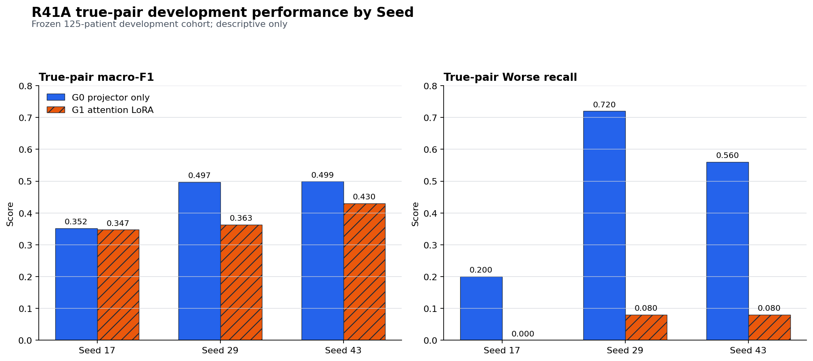

# PRTA-Gen R41A 失败案例研究：Qwen SFT 的类别支持崩塌与 Seed 不稳定性

状态：`DESCRIPTIVE_PRTA_GEN_R41A_FAILURE_CASE_STUDY`

## 技术摘要

R41A 的失败不是 JSON 格式、finding echo、cache 等价性或训练未完成造成的。
六个 arm 都完成 36 次 optimizer updates，schema/finding validity 均为
100%，cache audit 最大差为 0。失败发生在**自由贪心 progression 读出本身**：

- G1 attention-LoRA 在三 Seed 的 true-pair macro-F1 为
  0.3474 / 0.3632 / 0.4304，分别比容量匹配 G0 低
  0.46 / 13.40 / 6.85 pp；
- 每个 Seed 都有 25 个真实 `Worse` 样本，但 G1 仅输出
  0 / 7 / 9 次 `Worse`，对应 recall 为 0.00 / 0.08 / 0.08；
- 只有 31/125 个 development 样本在三个 G1 Seed 中全部答对，
  49/125 个样本三个 Seed 全部答错；
- true pair 相对 prior shuffle 存在部分正向响应，但 Seed 17 只有
  11 个 true-sensitive 对 9 个 control-favored 样本，且冻结 bootstrap
  门仍失败；这一信号不足以覆盖类别支持和 G0 对照失败。

因此，本案例研究进一步解释了
`STOP_PRTA_GEN_R41A_PROGRESSION_SFT_SURVIVAL`，但不改变它，也不解锁
R42A/R43。当前 proposal 已经跑通的是 progression-only structured head
的内部开发泛化；尚未跑通的是注册的 Qwen attention-LoRA
free-greedy progression readout。

## G1 的首要失败是 `Worse` 类支持近乎消失

下图并列展示冻结 true-pair development 上的宏平均 F1 与 `Worse`
recall。所有柱状图从 0 开始；颜色之外还用斜线区分 G1。它显示 G1
不仅没有稳定超过 G0，而且在 Seed 29/43 把 G0 已经具备的 `Worse`
支持大幅丢失。

| Seed | G0 macro-F1 | G1 macro-F1 | G1−G0 | G0 `Worse` recall | G1 `Worse` recall | G1 输出 `Worse` 次数 |
|---:|---:|---:|---:|---:|---:|---:|
| 17 | 0.3520 | 0.3474 | -0.46 pp | 0.20 | 0.00 | 0/125 |
| 29 | 0.4971 | 0.3632 | -13.40 pp | 0.72 | 0.08 | 7/125 |
| 43 | 0.4989 | 0.4304 | -6.85 pp | 0.56 | 0.08 | 9/125 |

`Worse` 错误并没有稳定落入同一个替代类别。Seed 17 的 25 个真实
`Worse` 被分到 Stable 9、Improved 10、New 4、Resolved 2；Seed 29
主要被分到 Resolved 16；Seed 43 主要被分到 New 11 和 Improved 6。
这排除了“只需修正一个固定 label mapping”的简单解释，更符合
Seed-dependent label mode 的描述。

这仍是描述性诊断，不证明具体因果机制。尤其不能根据这些去向在同一
125-patient development 上改 class weight、prompt、loss 或 checkpoint，
再把结果称为确认性改进。

## attention-LoRA 没有形成稳定的 G0→G1 改善

逐样本比较同一 Seed 的 G0/G1 true-pair prediction，可以直接看到新增
attention-LoRA 参数既修复一些错误，也破坏一些原本正确的输出：

| Seed | G0/G1 都对 | 仅 G0 正确 | 仅 G1 正确 | G0/G1 都错 | 净迁移（仅 G1−仅 G0） |
|---:|---:|---:|---:|---:|---:|
| 17 | 28 | 20 | 22 | 55 | +2 |
| 29 | 39 | 24 | 11 | 51 | -13 |
| 43 | 39 | 25 | 20 | 41 | -5 |

Seed 17 的逐样本净迁移接近中性，Seed 29/43 则明确为负。这与 macro-F1
方向一致：G1 的新增容量没有稳定转化为更好的 progression 绑定，Seed 29
甚至出现 79/125 次 Resolved 输出，显示强烈的 Seed-specific 类别集中。

finding 切片也存在方向不一致。按三 Seed 平均，G1 在 Cardiomegaly 与
Enlarged Cardiomediastinum 上高于 G0，但在 Pleural Effusion、
Atelectasis 与 Lung Opacity 上更低。由于 denominator 从 1 到 28
不等，这些切片只用于定位异质性，不能作为新的调参目标；例如 Lung
Lesion 只有 1 个 development 样本，任何 0% 或 100% 都没有独立解释力。

## true-pair 信号存在，但没有通过完整生存门

将 G1 true pair 与三个注册控制逐样本比较，得到：

| Seed | 对照 | true-sensitive | control-favored | 净 true-sensitive |
|---:|---|---:|---:|---:|
| 17 | current-only | 14 | 4 | +10 |
| 17 | query-only | 33 | 9 | +24 |
| 17 | prior-shuffle | 11 | 9 | +2 |
| 29 | current-only | 12 | 3 | +9 |
| 29 | query-only | 38 | 14 | +24 |
| 29 | prior-shuffle | 15 | 4 | +11 |
| 43 | current-only | 22 | 8 | +14 |
| 43 | query-only | 42 | 7 | +35 |
| 43 | prior-shuffle | 20 | 7 | +13 |

这说明 G1 并非完全忽略 longitudinal input：相对 current-only 和
query-only 的逐样本净值在三 Seed 都为正，prior-shuffle 在 Seed 29/43
也为正。但 R41A 的门是预先冻结的合取条件，而不是“任一控制正向即可”。
Seed 17 prior-shuffle 的 point/CI 门失败，三个 Seed 的 `Worse` recall
失败，且 G1−G0 全为负，所以局部响应不能改写总体 STOP。

## 跨 Seed 一致性不足以支持稳定生成

对 125 个相同 development 样本聚合三个 G1 true-pair prediction：

| 跨 Seed 模式 | 样本数 | 占比 |
|---|---:|---:|
| 三 Seed 全部正确 | 31 | 24.8% |
| 至少一 Seed 正确、但不全对 | 45 | 36.0% |
| 三 Seed 全错且错误类别不同 | 37 | 29.6% |
| 三 Seed 全错且错误类别相同 | 12 | 9.6% |

也就是说，39.2%（49/125）的样本在三个 G1 Seed 中没有一次答对；其中
多数还会随 Seed 改变错误类别。这是稳定性问题的直接观察证据，但不能单独
区分优化随机性、数据规模、解码动力学或标签先验哪一个是原因。

## 去标识化代表案例

以下案例由预先提交的分析器按固定模式选取，只保留 finding、target 与
离散 prediction；没有 patient/example ID，也不含图像、报告文本或
自由文本生成。它们用于解释 aggregate，不用于选择新模型。

| Case | 固定模式 | Finding | Target | Seed 17 G0/G1 | Seed 29 G0/G1 | Seed 43 G0/G1 |
|---|---|---|---|---|---|---|
| CASE-001 | 三 Seed G0 对、G1 错 | Pleural Effusion | Worse | Worse / Improved | Worse / Stable | Worse / Stable |
| CASE-003 | 三 Seed G1 修复 G0 | Edema | Resolved | New / Resolved | Worse / Resolved | Improved / Resolved |
| CASE-004 | 三 Seed G1 全错 | Pneumothorax | Stable | New / Resolved | New / Resolved | New / New |
| CASE-008 | 三 Seed true 对、shuffle 错 | Pleural Effusion | New | New / New | New / New | New / New |
| CASE-011 | 三 Seed G1 `Worse` 全错 | Atelectasis | Worse | Worse / Stable | Improved / Improved | Improved / Improved |

CASE-003 与 CASE-008 是必要反例：G1 有时能稳定修复 G0，真实 prior
也有时会稳定优于 shuffle。因此合理结论不是“Qwen 没有使用输入”，而是
这种使用没有形成跨类别、跨 Seed、优于 G0 的稳定生存结果。

## 范围、数据与指标定义

- **Population：** R41A 已完成的 125 名 patient-disjoint internal
  development 患者；train 为另 375 名患者。
- **Targets：** Stable、Improved、Worse、New、Resolved，各 25 名。
- **Model arms：** G0 projector-only；G1 attention-LoRA。
- **Evaluation arms：** true-pair、current-only、query-only、
  prior-shuffle。
- **主指标：** progression macro-F1、每类 recall、G1−G0；
  schema validity 与 finding echo 为必要工程门。
- **分析性质：** closed-result、read-only、descriptive secondary
  analysis；不是新 experiment，也没有 checkpoint/Seed/threshold
  selection。

## 方法与可复现性

分析器 `scripts/analyze_prta_gen_r41a_failure_cases.py` 在读取真实逐行
prediction 之前，已随 5 个 focused tests 提交并推送为 `0445a6d`。它：

1. 强制要求 Seeds 17/29/43 × G0/G1 六个注册结果；
2. 核对 schema、protocol、36 updates、exact-64/no-pixel 与所有 outcome
   firewall；
3. 核对六个结果的 classes、targets、example/patient order 完全一致；
4. 核对 immutable roster SHA-256
   `2BA53C95...F77C0` 及 375/125 patient-disjoint partition；
5. 从 prediction 重新计算 accuracy、macro-F1 和每类 recall，并与记录值
   逐项比对；
6. 只输出 aggregate 与 `CASE-###`，禁止 `example_id`/`patient_id` 字段。

派生 JSON 状态为
`DESCRIPTIVE_PRTA_GEN_R41A_FAILURE_CASE_STUDY`，SHA-256 为
`59C64E21B1520F439CB41F729E4720137D2A6803BEFA4E25A9D51684B86EA37A`。
它明确记录 `new_training_started=false`、
`observed_development_reuse_for_selection_allowed=false` 和
`scientific_claim_allowed=false`。

## 局限性、稳健性与验证结论

验证结论：**可作为内部技术失败报告共享，但必须保留描述性边界。**

- 125 名患者来自既有内部开发域，不是 independent scientific
  confirmation、gold 或 external cohort。
- confusion、migration、control 与跨 Seed 计数都由同一冻结 prediction
  重算；这提高了审计性，但没有增加新的独立样本。
- finding-level denominator 严重不均衡，低支持切片不能排序、调参或形成
  subgroup claim。
- 三 Seed 能显示随机性风险，但不足以确定优化失败的因果机制。
- 本分析没有读取 protected 300-dev、revealed 483-test、gold 或
  external outcome；R42A/R43 仍未创建或启动。

## Proposal 的下一步

当前 R41A 不应再跑。正确的下一步分两层：

1. **现在完成：** 保留 R40C structured path 的有限 GO，同时把 R41A
   Qwen SFT 写成有机制线索的负结果；更新 Proposal、状态和论文材料。
2. **将来若有真正独立资源：** 在任何新 outcome 可见前，单独预注册新的
   progression readout survival 协议；固定数据、类别支持门、G0/G1
   对照和 Seed 规则，再用未参与本次诊断的 patient cohort 评价。

新协议可以把“类别支持崩塌”和“Seed-dependent label concentration”作为
待证伪假设，但不能在当前 125 人上搜索 class weights、loss、prompt、
learning rate 或 checkpoint。R42A/R43 仍受原 R41A GO 门约束，不能因本
案例研究而自动执行。

## 尚待回答的问题

- 在全新 cohort 上，G1 的 `Worse` 低输出是否复现，还是本次
  optimization/data realization 特有？
- 类别集中发生在训练早期还是 decoding 阶段？回答它需要新的、先冻结的
  telemetry 协议，而不是回看后挑 checkpoint。
- 保持 Qwen 自由生成的前提下，是否存在同时保留 G0 类别支持并提高
  prior sensitivity 的预注册读出方式？
- 若没有足够独立 cohort，是否应停止生成路线，把 structured head
  作为当前唯一可支持的 progression emission 主线？
