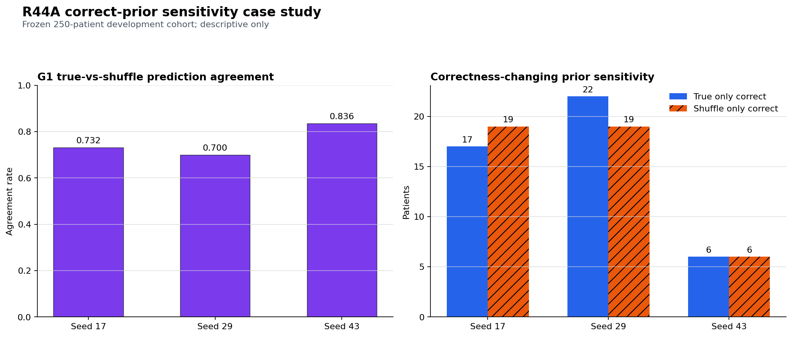

# PRTA-Gen R44A Failure Case Study 与 R45 方向选择

状态：`DESCRIPTIVE_PRTA_GEN_R44A_FAILURE_CASE_STUDY`

日期：2026-07-31

## 直接结论

R44A 没有失败在 JSON 格式、finding echo 或“完全看不见视觉输入”：

- 六个 arm 的 schema validity 与 finding echo 均为 100%；
- G1 true-pair 相对 query-only 有 +24.42/+21.14/+18.04 pp；
- 但 true-pair 与 same-finding prior-shuffle 的预测仍有
  73.2%/70.0%/83.6% 完全相同；
- true-only correct 与 shuffle-only correct 为 17/19、22/19、6/6，
  正确 prior 带来的净正确性变化仅 -2/+3/0 名患者；
- G0→G1 recovery/regression 为 35/28、22/19、19/35，Seed 43 净退化
  16 名患者。

因此最符合证据的失败机制是：

1. **correct-prior under-use**：模型对同 finding、跨患者 shuffled prior
   的输出经常保持不变；
2. **adapter optimization instability**：attention-LoRA 对 G0 的净迁移
   随 Seed 改变，并在 Seed 43 明显为负；
3. **class emission bottleneck 是局部而非全部解释**：Seed 43 的 `Worse`
   极差，但 prior invariance 同时分布于五个均衡类别。

R44A 仍保持
`STOP_PRTA_GEN_R44A_CROSS_SOURCE_SILVER_SFT_SURVIVAL`。本分析不授权对其
250-patient development 调参。

## 冻结分析边界

分析器、测试、输入 hash 和判别规则均在读取 row-level predictions 前以
commit `4f1e40d` 提交并推送。分析仅使用六个 result JSON 与 immutable
roster 的 aligned class indices：

- 不读取图像、token、checkpoint tensor 或报告文本；
- 不输出 patient/example identity 或可逆 hash；
- 不启动训练；
- 不读取 protected 300-development、revealed 483-test、gold 或
  external outcome；
- 不启动 R42/R43。

输出 artifact：

`H:\VisualVIT_runtime\050_routeD\r37_prta_cxr\prta_gen_r44a_failure_case_study_v1\case_study.json`

SHA-256：
`06CF579923BA8C061DA0D3017BE5305DDE6B1C3F4505F48B6195D55EDD3EC483`

## Correct-prior sensitivity

| Seed | True/shuffle 同预测 | Changed | True-only correct | Shuffle-only correct | Net true-sensitive |
|---:|---:|---:|---:|---:|---:|
| 17 | 0.732 | 67 | 17 | 19 | -2 |
| 29 | 0.700 | 75 | 22 | 19 | +3 |
| 43 | 0.836 | 41 | 6 | 6 | 0 |

跨 Seed 看，250 名患者中：

- 135 名在三个 Seed 中都不因 prior shuffle 改变预测；
- 58 名仅一个 Seed 改变；
- 46 名两个 Seed 改变；
- 只有 11 名三个 Seed 都改变。

这不是“模型对 prior 完全无反应”：仍有 16.4%–30.0% 的预测发生改变。
关键问题是改变没有稳定朝正确方向发生，所以 aggregate 的
true-vs-shuffle effect 与 bootstrap CI 全部失败。

## G0→G1 迁移

| Seed | G1 recovery | G1 regression | Net G1 |
|---:|---:|---:|---:|
| 17 | 35 | 28 | +7 |
| 29 | 22 | 19 | +3 |
| 43 | 19 | 35 | -16 |

attention-LoRA 不是稳定无效，而是高方差：Seed 17/29 有小幅净修复，
Seed 43 则显著破坏 projector-only 已正确的样本。这与仅增加训练数据并不
足以稳定 Qwen readout 的 R44A 结论一致。

## 类别分析

R44A development 每类恰好 50 名患者，因此这些结果不能归因于 evaluation
class imbalance。

- Seed 43 `Worse`：true/shuffle 均正确为 0，36/50 在两臂输出相同错误类；
- Seed 43 `New`：43/50 在 true/shuffle 下输出相同错误类；
- 其余 Seed/类别也普遍存在 both-wrong-same-prediction；
- `Resolved` 在 Seed 17/29 相对较好，但仍没有形成跨 Seed 的正确 prior
  优势。

所以类别崩塌需要被报告，但下一方法不能只做 class reweighting；它必须
显式把 prior-dependent change 表示传入生成路径。

## 之前失败方式总结

| 路线 | 做到了什么 | 失败点 |
|---|---|---|
| R40B free/constrained Qwen smokes | 学会 schema/finding | progression 不能稳定 32/32 overfit |
| R40B.4/R40C structured head | progression representation 可读，且内部 patient-disjoint GO | 不是 Qwen free generation |
| R41A attention-LoRA SFT | schema/finding 100%，局部 prior sensitivity | `Worse` 支持和 G1−G0 崩塌，8 gates failed |
| R44A 更大 cross-source silver SFT | query-only separation、部分类别发射改善 | true-vs-shuffle 几乎无净正确收益，Seed 43 退化，9 gates failed |

由此可以排除的简单修复包括：

- 再扩大同类 silver 数据；
- 只增加 LoRA/Seed；
- 只做 class weighting；
- 把 shuffled prior 教成一个人工“invalid”第六类；
- 在已观察 R44A development 上选 checkpoint/threshold。

## 相关工作与 ICLR novelty 边界

当前官方 ICLR reviewer guide 要求问题具体、方法动机充分、实验严谨、
claim 被证据支持并贡献新知识；不要求必须 SOTA。Author guide 同时强调
reproducibility statement、代码/数据处理说明与 ethics boundary
（[ICLR Reviewer Guide](https://iclr.cc/Conferences/2026/ReviewerGuide)；
[ICLR Author Guide](https://iclr.cc/Conferences/2026/AuthorGuide)）。

相关方法已经占据两个相邻方向：

- [CORAL](https://arxiv.org/abs/2607.03647) 已用 generic hard-negative
  image swap 的 contrastive grounding objective 惩罚 medical VQA
  answer invariance；
- [TILA](https://openreview.net/forum?id=fOrlaEUG5H) 已用 prior/current
  temporal inversion、bidirectional CE 和 consistency loss 处理三分类
  progression direction；
- [CheXTemporal](https://arxiv.org/abs/2605.11304) 定义了本项目使用的
  五类 temporal/spatial reasoning 数据；
- longitudinal anatomical-token fusion 与
  [Libra](https://arxiv.org/abs/2411.19378) 已证明 temporal multi-image
  fusion 是独立研究方向；
- [LUNGUAGE](https://proceedings.mlr.press/v333/moon26a.html) 强调
  structured sequential radiology evaluation。

因此 R45 不能把“hard negative”“pair inversion”或“structured
longitudinal evaluation”本身写成新贡献。

## 新尝试：R45 Causal Delta Evidence Bottleneck

R45 的具体问题是：

> 一个显式、可审计的 prior-dependent delta bottleneck，能否把已经
> qualification 的 exact64 temporal representation 稳定地传递给冻结 Qwen
> free generation，并在 untouched patients 上同时优于 Qwen SFT baseline
> 与 same-finding prior-shuffle？

候选方法 **CDEB**：

1. 从同一 example 的 `true_pair` 与 `current_only` exact64 tokens 计算
   explicit delta；
2. 用训练集拟合五类 auxiliary progression head；
3. 将 head 的 soft class distribution 映射成固定数量、固定 64-budget
   内的 evidence tokens；
4. 让冻结 Qwen 依据原 visual tokens 加 evidence tokens 生成同一合法
   两字段 JSON；
5. shuffled/current/query controls 走完全相同计算图，不增加人工 output
   class。

注册 baselines/ablations 至少包括：

- inherited Qwen projector/LoRA baseline；
- structured delta-head upper-bound/reference；
- no-delta evidence bottleneck；
- delta head without evidence-token bridge；
- full CDEB。

核心主张只允许是：在冻结数据、模型和 gate 下，CDEB 是否提高
progression-only correct-prior-specific free generation。它不自动外推到
开放式报告、gold/external、临床部署或所有 VLM。

## 下一步

先审计并冻结排除全部 R44A patients 的新四分区 roster：
discovery-train、discovery-development、sealed qualification 和独立
confirmation。只允许 discovery 分区参与候选选择；qualification/confirmation
在最终方法、baseline、ablation、Seed、compute 和 statistics 全部提交后
各揭示一次。
