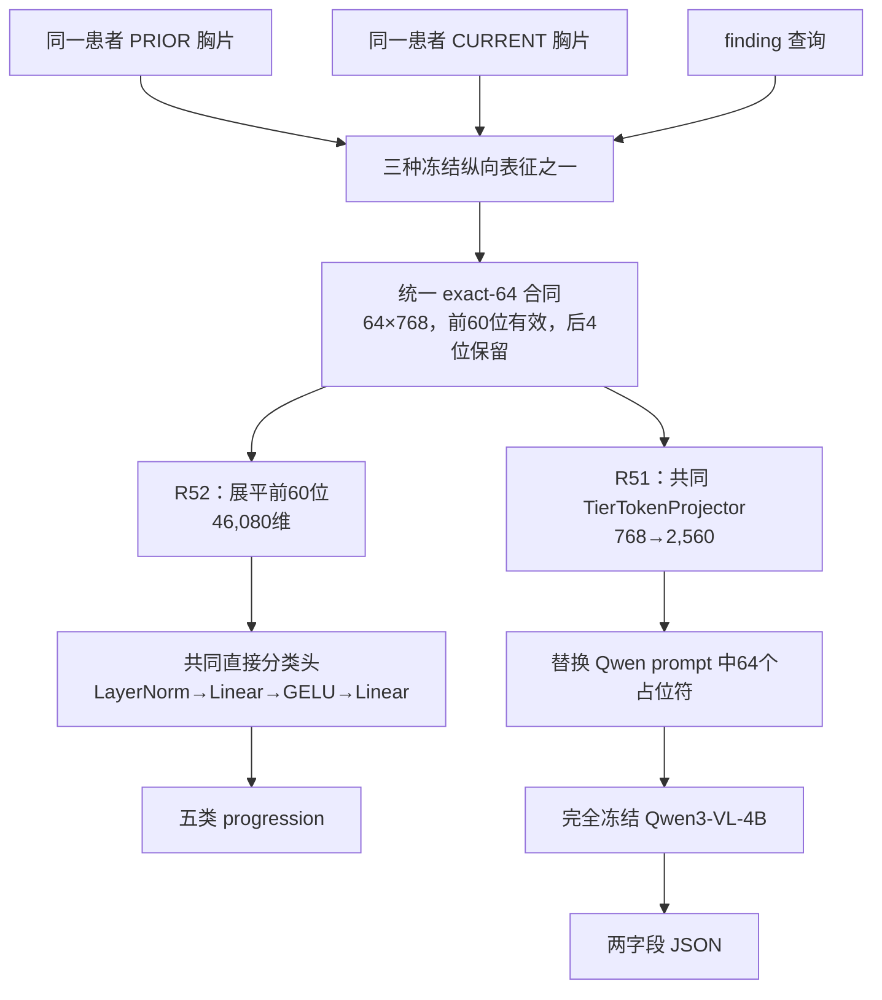

# PRTA-Gen R51/R52 双部署方法学与匹配对比实验详解

> 文档性质：从零开始的方法学、部署与结果说明
> 对应实验：R51 与 R52
> R51 终态：`COMPLETE_PRTA_GEN_R51_MATCHED_INTERFACE_BENCHMARK`
> R52 终态：`COMPLETE_PRTA_GEN_R52_MATCHED_DIRECT_HEAD_BENCHMARK`
> 适用范围：内部、患者级匹配的纵向胸片五分类实验；不代表临床验证

## 1. 一句话结论

R51 和 R52 检验的是**同一组三种 64-token 纵向胸片表征，在两种不同部署方式下是否仍能稳定区分五类时间变化**：

- **R52：独立视觉表征分类部署**。它不调用大语言模型，而是把 60 个有效视觉 token 直接展平，送入一个三臂完全相同的小型五分类头；口语上可以把它理解为“视觉编码器/ViT 一侧单独部署”。
- **R51：VLM 部署**。它把同样的 64 个物理视觉位置先送入一个三臂完全相同的 projector，再注入完全冻结的 Qwen3-VL-4B，由 Qwen 自回归生成严格的两字段 JSON。

两种部署的共同结论都是：**在本次相同患者、相同 exact-64 输入合同和相同下游读出容量下，PRTA 的 Macro-F1 显著高于 TILA-exact64 和 B2-exact64。**

| 部署方式 | PRTA | TILA-exact64 | B2-exact64 | PRTA 相对 TILA | PRTA 相对 B2 |
|---|---:|---:|---:|---:|---:|
| R52：统一直接分类头 | **0.360519** | 0.273051 | 0.267938 | **+8.747 pp**，95% CI `[+4.481,+12.861]` | **+9.258 pp**，95% CI `[+4.768,+13.199]` |
| R51：统一 projector + 冻结 Qwen | **0.384796** | 0.316618 | 0.255090 | **+6.818 pp**，95% CI `[+3.512,+10.080]` | **+12.971 pp**，95% CI `[+9.729,+16.286]` |

这里的“显著”只指本次注册的 500 名内部评估患者上，患者配对 bootstrap 的 95% 置信区间下界大于 0；它不是跨医院、gold、external 或临床意义上的普遍结论。

---

## 2. 先把术语说清楚

### 2.1 R51 与 R52 分别是什么

用户口述中的“51 和 52”“单独 ViT 部署”和“作为 VLM 部署”，在当前项目里对应如下：

| 编号 | 本文采用的准确名称 | 核心读出方式 | 最终输出 |
|---|---|---|---|
| R52 | 独立视觉表征直接分类部署 | exact-64 token → 展平 → 小型神经网络分类头 | 五类之一及五类 logits |
| R51 | 冻结 VLM 结构化生成部署 | exact-64 token → projector → 冻结 Qwen | `{"finding":"...","progression":"..."}` |

严格地说，R52 不是“把一个完整 ViT 端到端重新训练并部署”。三种视觉方法已经提前产生冻结的 exact-64 表征，R52 训练的是共同的分类头。因此更准确的名称是**独立视觉表征分类部署**。它代表“不经过语言模型，直接从视觉表征做决策”的路线。

R51 也不是让 Qwen 重新读取两张原始像素图。Qwen 接收到的是已经压缩并对齐的 64 个物理视觉位置。因此它代表**把纵向视觉表征作为 VLM 的视觉前缀进行结构化生成**。

### 2.2 什么是纵向胸片任务

每个样本包含同一患者的两个时间点：

- `PRIOR`：较早的胸部 X 光片；
- `CURRENT`：较晚的胸部 X 光片；
- `finding`：当前要判断的具体影像学发现，例如某一病灶或征象；
- `progression`：该 finding 从 PRIOR 到 CURRENT 的变化类别。

本实验只预测以下五类：

| 类别 | 语义 |
|---|---|
| `Stable` | 该 finding 在两个时间点总体稳定，没有明确改善或恶化 |
| `Improved` | 该 finding 仍存在，但程度减轻或表现改善 |
| `Worse` | 该 finding 仍存在，但程度增加或表现恶化 |
| `New` | PRIOR 不存在或不明显，CURRENT 新出现 |
| `Resolved` | PRIOR 存在，CURRENT 消失或基本消退 |

这些类别不是单张图像的静态诊断标签。`New` 与 `Resolved` 尤其要求模型理解**方向**：交换 PRIOR 和 CURRENT 后，语义应发生相应变化。

### 2.3 什么是 representation、token、projector 和 VLM

- **Representation（表征）**：视觉编码器把图像转换成的数值特征。它不一定能直接被人阅读，但应保留对任务有用的信息。
- **Patch token**：ViT 把图像切成网格 patch 后，每个 patch 对应的向量。
- **Visual token**：本文统一送入下游接口的 768 维向量。一个样本有 64 个物理位置。
- **Projector**：把 768 维视觉 token 变换成 Qwen 隐藏维度 2,560 的可训练桥接网络。
- **VLM**：视觉语言模型。R51 中使用完全冻结的 Qwen3-VL-4B-Instruct 作为语言读出器。
- **Direct head**：不经过语言模型，直接把视觉特征映射为五类 logits 的小型分类网络。

---

## 3. 整体实验结构



这个设计把问题拆成两层：

1. **视觉表征层**：PRTA、TILA-exact64、B2-exact64 如何把两张片编码成同形状的 token；
2. **部署读出层**：同一份 token 是直接分类，还是交给冻结 VLM 生成答案。

R51 与 R52 的关键价值在于：两项实验使用相同三种表征和相同患者，分别更换读出器。若 PRTA 只在某一种读出器下领先，就可能是读出器适配偶然性；如果两种读出器下方向一致，则说明表征本身更可能包含更容易读取的时间变化信息。

---

## 4. 共同数据合同与公平性设计

### 4.1 训练与评估患者

| 分区 | 患者数 | 每类患者数 | 每患者样本数 | 用途 |
|---|---:|---:|---:|---|
| 训练集 | 2,500 | 500 | 1 | 训练 R51 projector 或 R52 direct head |
| 评估集 | 500 | 100 | 1 | 一次性比较三种方法 |

评估集满足：

- 500 名患者、500 个样本，一名患者一行；
- 五类严格平衡，每类 100 名患者；
- 训练患者与评估患者零重叠；
- R51 与 R52 使用完全相同的训练患者、评估患者和 exact-64 cache；
- 比较时每个方法对的是同一个患者，因此可以做患者配对统计。

### 4.2 三臂共同不变量

| 项目 | 三臂共同设置 |
|---|---|
| 方法臂 | `prta_exact64`、`tila_exact64`、`b2_exact64` |
| token 物理形状 | `[64,768]` |
| 有效视觉位置 | 0–59，共 60 个 |
| 保留位置 | 60–63，共 4 个，数值必须精确为 0 |
| token 翻译可训练参数 | 0 |
| 共同归一化 | 每样本、每有效 token 的 RMS normalization |
| 随机种子 | 17、29、43 |
| 评估主指标 | Macro-F1 |
| 次指标 | Accuracy、逐类 recall |
| 区间估计 | 2,000 次患者配对 bootstrap |
| outcome 后调参 | 禁止 |
| early stopping / seed 选择 | 禁止 |

### 4.3 为什么采用 exact-64

不同方法原生输出的形状不同：

- PRTA 已有 60 个有效的 768 维层次化时间 token；
- TILA 的本次接口输入来自 `[128,14,14]` projected patch map，即 196 个 128 维 patch；
- B2 可使用 197 个 768 维 BiomedCLIP token，包括 1 个 CLS 与 196 个 patch。

如果直接让每种方法使用自己的任意长度和维度，下游模型容量、视觉预算与计算量都会不同，结果很难归因。exact-64 的作用是把三者压到同一个物理接口：

\[
X \in \mathbb{R}^{64\times768},\qquad
X_{0:60}\ \text{为有效 token},\qquad
X_{60:64}=0.
\]

这不是声称三种 token 的内部语义完全相同，而是给它们相同的下游输入尺寸和物理预算。

### 4.4 共同 RMS 归一化

对每个有效 token \(x\in\mathbb{R}^{768}\)，计算：

\[
\operatorname{RMS}(x)=\sqrt{\max\left(\frac{1}{768}\sum_{j=1}^{768}x_j^2,10^{-6}\right)},
\qquad
\hat{x}=\frac{x}{\operatorname{RMS}(x)}.
\]

随后重新拼接四个全零保留位。这样做的目的，是防止某个表征仅因向量尺度更大而让共同读出器更容易优化。它保留方向与相对结构，不把某个方法的幅值范围当成额外优势。

---

## 5. 三种视觉表征的方法学

## 5.1 PRTA exact-64：finding 引导的跨时间对齐

PRTA 是本项目提出的方法。它的核心思想不是简单地把两张图放在一起，而是显式回答：

> 对于当前指定的 finding，PRIOR 的哪些局部区域与 CURRENT 的哪些局部区域相对应，它们发生了什么方向的变化？

### 5.1.1 输入

PRTA 接收三类信息：

1. PRIOR 的 patch-level 视觉特征；
2. CURRENT 的 patch-level 视觉特征；
3. 当前 finding 的文本查询向量。

finding 查询非常重要。同一对胸片中可能同时存在多个发现，而不同 finding 对应的关键区域不同。以 finding 作为查询，可让模型优先关注与当前问题相关的 patch，而不是把整张图的全部变化无差别混合。

### 5.1.2 finding-conditioned attention

令 prior patches 为 \(P\in\mathbb{R}^{N\times d}\)，current patches 为 \(C\in\mathbb{R}^{M\times d}\)，finding query 为 \(q\in\mathbb{R}^{d}\)。PRTA 对两个时间点分别计算 query-to-patch attention：

\[
a^P_i=\operatorname{softmax}_i\left(\frac{q^\top K(P_i)}{\sqrt d}\right),
\qquad
a^C_j=\operatorname{softmax}_j\left(\frac{q^\top K(C_j)}{\sqrt d}\right).
\]

然后分别得到 finding 相关的局部摘要：

\[
p_{local}=\sum_i a^P_iP_i,\qquad
c_{local}=\sum_j a^C_jC_j.
\]

模型同时保留全局平均信息 \(p_{global}\) 与 \(c_{global}\)，使局部变化能够放在全片背景中解释。

### 5.1.3 跨时间 patch 对应

对每个 PRIOR patch，PRTA 计算其与所有 CURRENT patch 的相似度并得到 soft correspondence：

\[
S_{ij}=\frac{K(P_i)^\top C_j}{\sqrt d},\qquad
A_{ij}=\operatorname{softmax}_j(S_{ij}),\qquad
\widetilde C_i=\sum_j A_{ij}C_j.
\]

\(\widetilde C_i\) 是与 prior patch \(P_i\) 软匹配的 current 表征。随后可以构造：

- prior 状态 \(P_i\)；
- matched current 状态 \(\widetilde C_i\)；
- 有方向差分 \(\widetilde C_i-P_i\)；
- 无方向变化强度 \(|\widetilde C_i-P_i|\)；
- 交互项 \(P_i\odot\widetilde C_i\)；
- correspondence entropy，用于描述匹配是否集中或不确定；
- finding relevance，用于描述该 patch 与当前 finding 的关系。

这使 PRTA 的 token 不只是“两张图各自长什么样”，还编码“相关位置从前到后如何变”。

### 5.1.4 64-token 层次化布局

PRTA 原生采用固定布局：

| 物理位置 | 数量 | 类型 | 主要信息 |
|---|---:|---|---|
| 0–3 | 4 | Query | finding query、prior global、current global、global difference |
| 4–15 | 12 | State | CURRENT 中 finding 相关性最高的状态 patch |
| 16–31 | 16 | Global transition | prior/current 全局状态及 signed/absolute/interaction 变化 |
| 32–47 | 16 | Local transition | finding 相关局部区域的方向变化 |
| 48–59 | 12 | Relation | prior-to-current 跨时间对应关系与不确定性 |
| 60–63 | 4 | Reserved | 精确零保留位 |

因此 PRTA 的 60 个有效 token 在生成时已经具有明确的任务结构。R51/R52 不再针对评估结果重新学习或修改这套 translation。

### 5.1.5 本次实验中的冻结方式

- 使用冻结的 R37 PRTA finding-guided cross-time alignment；
- exact-64 cache 本身不包含标签；
- R51/R52 都不回传梯度更新 PRTA；
- 进入下游接口前只做共同的逐 token RMS normalization。

所以 R51/R52 比较的是**冻结 PRTA 表征的可读性**，不是重新微调 PRTA 后的端到端结果。

## 5.2 TILA exact-64：官方 TILA patch 表征的固定接口适配

### 5.2.1 哪部分是现成方法，哪部分是本项目适配

TILA 的预训练图像编码器、时间间隔建模模块、checkpoint 和 projected patch representation 来自官方方法与官方模型。官方来源在冻结配置中固定为：

- 模型仓库：`lukeingawesome/TILA`；
- 固定 revision：`a9c6da4b07651de5469e54b5903a63d33f4dfc6a`；
- 权重：`model.safetensors`；
- 权重 SHA-256：`B16B6BCF47AC6E4E79C4D9DA2DB88055B297ADCA22715935E4522184F87CE101`；
- 许可证：MIT；
- 论文入口：[Temporal Inversion for Learning Interval Change in Chest X-Rays](https://openaccess.thecvf.com/content/CVPR2026/html/Ko_Temporal_Inversion_for_Learning_Interval_Change_in_Chest_X-Rays_CVPR_2026_paper.html)。

但下面这些属于本项目为匹配接口而做的适配，不是“原论文端到端系统原样运行”：

- 从 196 个 projected patches 固定取 60 个；
- 从 128 维无参数扩展到 768 维；
- 接入 R51 的共同 projector 或 R52 的共同 direct head；
- 预测本项目的 finding-conditioned 五类 progression。

因此本文始终称它为 **TILA-exact64**，而不是笼统地称为“官方 TILA 完整系统”。

### 5.2.2 原生 patch map

本实验读取官方编码器输出的：

\[
T\in\mathbb{R}^{128\times14\times14}.
\]

将空间维展平后得到 196 个 128 维 token：

\[
T_{flat}\in\mathbb{R}^{196\times128}.
\]

### 5.2.3 固定选择 60 个 patch

为了避免 outcome 后学习选择器，位置在运行前固定。零起始索引为：

```text
0, 3, 7, 10, 13, 17, 20, 23, 26, 30,
33, 36, 40, 43, 46, 50, 53, 56, 59, 63,
66, 69, 73, 76, 79, 83, 86, 89, 93, 96,
99, 102, 106, 109, 112, 116, 119, 122, 126, 129,
132, 136, 139, 142, 145, 149, 152, 155, 159, 162,
165, 169, 172, 175, 178, 182, 185, 188, 192, 195
```

这些位置覆盖整个 14×14 网格，而不是按评估标签挑选局部区域。

### 5.2.4 128 维到 768 维

每个 128 维 token 的每一维连续重复 6 次：

\[
[t_1,t_2,\ldots,t_{128}]
\mapsto
[\underbrace{t_1,\ldots,t_1}_{6},
 \underbrace{t_2,\ldots,t_2}_{6},\ldots,
 \underbrace{t_{128},\ldots,t_{128}}_{6}].
\]

因为 \(128\times6=768\)，可以无训练参数地匹配公共宽度。需要强调：重复不会创造新信息，它只是一个确定性维度适配，避免给 TILA 单独增加可训练桥接层。

最后添加 4 个全零 token，并应用共同 RMS normalization，得到 `[64,768]`。

## 5.3 B2 exact-64：冻结 BiomedCLIP 的经典 Siamese 时间差分对照

### 5.3.1 方法来源

B2 不是某个可下载的、带官方 checkpoint 的完整命名论文系统。它是本项目实现的透明经典 Siamese control：两个时间点共享同一个冻结视觉编码器，然后显式组合 prior、current、有符号差分和绝对差分。

这里的 “Siamese” 指 PRIOR 和 CURRENT 使用**相同权重**的冻结 BiomedCLIP 编码器；它不表示额外训练了两个独立模型。

### 5.3.2 冻结 patch 表征

每个时间点产生：

\[
P,C\in\mathbb{R}^{197\times768},
\]

其中位置 0 是 CLS，位置 1–196 是 patch token。本次固定选择 15 个非 CLS 位置：

```text
1, 15, 29, 43, 57, 71, 85, 99, 112, 126, 140, 154, 168, 182, 196
```

### 5.3.3 四组时间特征

先分别对选中的 prior/current token 做 L2 normalization。对每个选中位置构造四组 token：

1. `prior`：\(\hat P\)，15 个；
2. `current`：\(\hat C\)，15 个；
3. `current_minus_prior`：\(\hat C-\hat P\)，15 个；
4. `absolute_difference`：\(|\hat C-\hat P|\)，15 个。

按上述顺序拼接：

\[
X_{B2}=[\hat P;\hat C;\hat C-\hat P;|\hat C-\hat P|]
\in\mathbb{R}^{60\times768}.
\]

然后补四个全零 token，并做共同 RMS normalization。

有符号差分保留“前到后”的方向，无符号差分保留变化幅度。B2 的作用是检验：仅靠经典共享编码器和显式差分，能否达到 finding-guided cross-time alignment 的效果。

## 5.4 三种表征的本质差异

| 维度 | PRTA exact-64 | TILA exact-64 | B2 exact-64 |
|---|---|---|---|
| 来源 | 本项目提出 | 官方 TILA 表征 + 本项目接口适配 | 本项目实现的经典控制 |
| finding 是否参与视觉组织 | 是，finding-guided | exact-64 translation 本身不使用本项目 finding query 重排 patch | 否，固定空间 patch |
| 是否显式跨时间匹配局部位置 | 是，soft correspondence | 由 TILA 原生时间表征提供信息，但本地 translation 是固定 patch 抽取 | 否，按固定相同序号做差分 |
| 是否显式使用 signed difference | 是 | 由官方表示内部决定 | 是 |
| 是否显式使用 absolute difference | 是 | 由官方表示内部决定 | 是 |
| exact-64 translation 可训练参数 | 0 | 0 | 0 |
| 最终形状 | `[64,768]` | `[64,768]` | `[64,768]` |

---

## 6. R52：独立视觉表征直接分类部署

## 6.1 部署目标

R52 要回答的是：

> 如果不依赖 Qwen，不进行语言生成，只用一个对三种表征完全相同的分类器，哪一种 frozen exact-64 representation 最容易被读成五类 progression？

这是一种更接近传统视觉分类系统的部署方式。其优点是结构短、训练快、输出确定；缺点是只给出固定标签，不天然生成结构化文本或扩展字段。

## 6.2 输入检查与展平

每批输入必须满足：

\[
X\in\mathbb{R}^{B\times64\times768},
\]

并通过三个检查：

1. 形状必须精确为 `[B,64,768]`；
2. 所有数值必须有限；
3. `X[:,60:64,:]` 必须全部为 0。

R52 只保留前 60 个有效位置并展平：

\[
z=\operatorname{vec}(X_{0:60})in\mathbb{R}^{60\times768}
=\mathbb{R}^{46,080}.
\]

它没有使用 PRTA 原生的 4/12/16/16/12 分区池化。原因是：TILA 的 60 个 token 是空间 patch 序列，B2 的 60 个 token 是四组 component 序列；若使用 PRTA 专属语义池化，会把 PRTA 的内部边界先验强加给其他方法。统一展平保留所有 60 个位置，同时让分类器实现完全一致。

## 6.3 训练集统计标准化

每个方法臂只使用自己的 2,500 条训练特征计算逐维均值与标准差：

\[
\mu_j=\frac1N\sum_{i=1}^N z_{ij},\qquad
\sigma_j=\max(\operatorname{Std}(z_{:j}),10^{-6}),
\qquad
\widetilde z_{ij}=\frac{z_{ij}-\mu_j}{\sigma_j}.
\]

评估数据只能使用训练集得到的 \(\mu\) 和 \(\sigma\)，不能用评估集重新归一化。这可以防止评估分布信息泄漏进模型。

每个方法需要自己的训练统计，因为三种 frozen representation 的坐标含义和分布不同；但统计计算算法完全相同，且没有使用评估标签。

## 6.4 共同分类头

所有方法使用逐字相同的 `ProgressionDecisionHead`：

```text
46,080-dimensional feature
        ↓
LayerNorm(46,080)
        ↓
Linear(46,080 → 128)
        ↓
GELU
        ↓
Linear(128 → 5)
        ↓
five progression logits
```

数学形式为：

\[
h=\operatorname{GELU}(W_1\operatorname{LN}(\widetilde z)+b_1),
\qquad
\ell=W_2h+b_2,
\qquad
\hat y=\arg\max_k\ell_k.
\]

参数量逐项为：

| 模块 | 参数量 |
|---|---:|
| LayerNorm：scale + bias | \(2\times46,080=92,160\) |
| Linear 46,080→128 | \(46,080\times128+128=5,898,368\) |
| Linear 128→5 | \(128\times5+5=645\) |
| **合计** | **5,991,173** |

三臂的 arm-specific trainable parameters 都是 **0**。也就是说，PRTA、TILA 和 B2 不各自拥有额外 adapter；唯一可训练模块就是同样的分类头。

## 6.5 初始化与训练

| 项目 | R52 设置 |
|---|---|
| Seeds | 17、29、43 |
| Epochs | 100 |
| Batch size | 128 |
| Optimizer | AdamW |
| Learning rate | 0.001 |
| Weight decay | 0 |
| Gradient clip norm | 1.0 |
| 每臂 optimizer updates | 2,000 |
| Early stopping | 否 |
| Checkpoint selection | 否 |

同一个 seed 内，三个方法臂的分类头初始化哈希相同，mini-batch 顺序相同。训练目标是标准五分类交叉熵：

\[
\mathcal L_{CE}=-\frac1N\sum_{i=1}^N\log
\frac{\exp(\ell_{i,y_i})}{\sum_{k=1}^5\exp(\ell_{i,k})}.
\]

100 epochs 不是从 100 个 checkpoint 中选择最好者；所有方法固定训练到 2,000 updates，没有早停或按评估结果选 epoch。

## 6.6 R52 单样本推理流程

```python
# 概念伪代码，不替代仓库实现
tokens = frozen_encoder(prior_image, current_image, finding)  # [64, 768]
assert tokens[60:64].eq(0).all()
features = tokens[:60].reshape(46080)
features = (features - training_mean) / training_std
logits = shared_direct_head(features)
progression = CLASSES[logits.argmax()]
```

部署时需要保存：

- 产生 exact-64 token 所需的冻结视觉模型；
- 对应方法/seed 的训练集 `feature_mean` 与 `feature_std`；
- direct-head checkpoint；
- 固定的五类标签顺序。

## 6.7 R52 完整结果

### 6.7.1 Macro-F1 与 accuracy

| 方法 | Seed | Macro-F1 | Accuracy | 训练+评估耗时（秒） |
|---|---:|---:|---:|---:|
| PRTA exact-64 | 17 | 0.354955 | 0.354 | 20.639 |
| PRTA exact-64 | 29 | 0.370107 | 0.372 | 21.239 |
| PRTA exact-64 | 43 | 0.356495 | 0.360 | 19.549 |
| **PRTA mean** | — | **0.360519** | **0.362** | — |
| TILA exact-64 | 17 | 0.268596 | 0.268 | 19.200 |
| TILA exact-64 | 29 | 0.271473 | 0.274 | 18.586 |
| TILA exact-64 | 43 | 0.279085 | 0.280 | 14.795 |
| **TILA mean** | — | **0.273051** | **0.274** | — |
| B2 exact-64 | 17 | 0.297222 | 0.300 | 19.679 |
| B2 exact-64 | 29 | 0.241118 | 0.246 | 18.944 |
| B2 exact-64 | 43 | 0.265473 | 0.264 | 20.365 |
| **B2 mean** | — | **0.267938** | **0.270** | — |

所有 R52 arm 的 peak CUDA allocated 都是 1,038,291,968 bytes，约 0.967 GiB。表中的耗时是该 formal arm 的训练加评估总耗时，不是单病例在线推理延迟。

### 6.7.2 每个 seed 的逐类 recall

| 方法 | Seed | Stable | Improved | Worse | New | Resolved |
|---|---:|---:|---:|---:|---:|---:|
| PRTA | 17 | 0.32 | 0.36 | 0.30 | 0.27 | 0.52 |
| PRTA | 29 | 0.36 | 0.31 | 0.40 | 0.26 | 0.53 |
| PRTA | 43 | 0.28 | 0.36 | 0.29 | 0.28 | 0.59 |
| **PRTA mean** | — | **0.320** | **0.343** | **0.330** | **0.270** | **0.547** |
| TILA | 17 | 0.19 | 0.30 | 0.26 | 0.33 | 0.26 |
| TILA | 29 | 0.19 | 0.36 | 0.36 | 0.25 | 0.21 |
| TILA | 43 | 0.30 | 0.34 | 0.23 | 0.26 | 0.27 |
| **TILA mean** | — | **0.227** | **0.333** | **0.283** | **0.280** | **0.247** |
| B2 | 17 | 0.16 | 0.37 | 0.33 | 0.32 | 0.32 |
| B2 | 29 | 0.13 | 0.26 | 0.40 | 0.21 | 0.23 |
| B2 | 43 | 0.20 | 0.28 | 0.32 | 0.17 | 0.35 |
| **B2 mean** | — | **0.163** | **0.303** | **0.350** | **0.233** | **0.300** |

R52 中 PRTA 的最大类别优势是 `Resolved`：0.547，而 TILA 和 B2 分别为 0.247 与 0.300。PRTA 的 `Stable` 也更高。它并非每类逐项第一：TILA 的 `New` 略高 0.010，B2 的 `Worse` 高 0.020。PRTA 的总体领先来自五类覆盖更均衡，尤其是恢复/消退方向，而不是每个类别都绝对最高。

### 6.7.3 患者配对 bootstrap

| 对比 | 三 seed 平均差 | 95% CI | 结论 |
|---|---:|---:|---|
| **PRTA − TILA** | **+8.747 pp** | **[+4.481,+12.861] pp** | CI 下界 > 0 |
| **PRTA − B2** | **+9.258 pp** | **[+4.768,+13.199] pp** | CI 下界 > 0 |
| TILA − B2 | +0.511 pp | [−3.100,+4.069] pp | 区间跨 0 |

R52 的预注册严格规则要求 `PRTA−TILA` 与 `PRTA−B2` 的 95% CI 下界都大于 0。两项均满足，因此聚合器输出：

```text
prta_strict_superiority_supported = true
```

---

## 7. R51：作为冻结 VLM 的结构化生成部署

## 7.1 部署目标

R51 要回答的是：

> 当视觉信息必须通过相同的 64-token 桥接接口进入冻结 Qwen，并由 Qwen 自由贪心生成 JSON 时，三种表征谁更容易被 VLM 正确读出？

这里训练的不是 Qwen 本身，而是视觉到语言隐藏空间的共同 projector。Qwen 的所有参数冻结，视觉像素不绕过 token 接口直接进入模型。

## 7.2 从 768 维视觉空间到 2,560 维 Qwen 空间

三种 `[64,768]` 输入都通过同一个 `TierTokenProjector(768→2560)` 架构：

```text
768-d visual token
        ↓
Linear(768 → 2,560)
        ↓
GELU
        ↓
Linear(2,560 → 2,560)
        ↓
+ token-type embedding
+ optional metadata embeddings/projections
        ↓
LayerNorm(2,560)
        ↓
2,560-d Qwen input embedding
```

共同 projector 包含六类位置类型：Query、State、Global transition、Local transition、Relation、Reserved。R51 对三臂使用相同的固定 4/12/16/16/12/4 物理类型模板和相同 projector 实现。

需要准确理解这一点：TILA 与 B2 的 token 原生语义并不等同于 PRTA 的层次化类型；R51 做到的是物理预算、projector 架构、类型模板和可训练容量相同，而不是证明三个输入的每个位置具有同一语义。

### 7.2.1 Projector 参数量

| 组成 | 参数量 |
|---|---:|
| Linear 768→2,560 | 1,968,640 |
| Linear 2,560→2,560 | 6,556,160 |
| 6 类 token-type embedding | 15,360 |
| anatomy embedding，513×2,560 | 1,313,280 |
| temporal embedding，3×2,560 | 7,680 |
| confidence projection | 2,560 |
| slot-mass projection | 2,560 |
| output LayerNorm | 5,120 |
| shared neutral embedding | 2,560 |
| **合计** | **9,873,920** |

三臂的 exact-64 translation 参数均为 0；三臂唯一训练的都是这个 9,873,920 参数 projector。Qwen trainable parameters 为 **0**。

### 7.2.2 有效位与保留位

- 位置 0–59：logical valid，经过 feature projection 与共同类型嵌入；
- 位置 60–63：logical invalid/reserved，被替换成同一个 learned neutral embedding；
- 64 个物理位置的 attention 都是 1，保证 Qwen 始终看到完全相同的序列长度；
- 保留位不携带某个样本独有的图像内容。

因此“exact-64”表示 64 个物理插槽，而有效视觉信息预算是 60 个 token。

## 7.3 64 个视觉占位符如何注入 Qwen

R51 的文本 prompt 中放置 64 个 sentinel token `<|fim_pad|>`，其 token ID 为 151662。构造 prompt 后必须验证占位符数量恰好为 64。

在 Qwen 第一次前向或生成步：

1. 先取得普通文本 token embedding；
2. 找出 64 个 sentinel 位置；
3. 用 projector 产生的 64 个 `[2560]` 视觉 embedding 逐位置替换 sentinel embedding；
4. 后续自回归生成使用 KV cache，不再次替换视觉位置；
5. 不传入原始 pixel values 或 video values。

这保证三臂的视觉通道只有一个：`exact-64 → projector → Qwen input embeddings`。

## 7.4 Prompt 与输出合同

系统提示词为：

```text
You are a chest radiograph temporal reasoning assistant.
Follow the requested JSON schema exactly.
```

共享任务提示为：

```text
Compare the PRIOR and CURRENT chest radiographs for the finding {finding}.
Return one compact JSON object with exactly two keys, finding and progression.
Copy the supplied finding exactly. progression must be one of Stable,
Improved, Worse, New, or Resolved. Do not add markdown or any other field.
```

目标输出采用紧凑 JSON，例如：

```json
{"finding":"Pleural Effusion","progression":"Improved"}
```

字段顺序固定为：

1. `finding`；
2. `progression`。

`finding` 必须原样回显，`progression` 必须属于五类集合。最大 target 长度为 64 个语言 token，并追加 EOS。

## 7.5 Assistant-only SFT

训练时，将 prompt token 与目标 JSON token 拼接，但只对 assistant 目标部分计算因果语言模型损失：

```text
[system + user + 64 visual placeholders] [assistant JSON + EOS]
              labels = -100               labels = token IDs
```

令目标 JSON token 为 \(y_1,\ldots,y_T\)，损失为：

\[
\mathcal L_{SFT}
=-\frac1T\sum_{t=1}^{T}\log p_\theta(y_t\mid
\text{prompt},\text{visual tokens},y_{<t}).
\]

由于 Qwen 参数冻结，梯度只更新 projector。模型学习的是：如何把当前 frozen visual representation 映射成 Qwen 已有语言空间可以利用的 64 个视觉前缀 embedding。

## 7.6 R51 训练配置

| 项目 | R51 设置 |
|---|---|
| Qwen | Qwen3-VL-4B-Instruct |
| Qwen dtype | bfloat16 |
| Qwen hidden size | 2,560 |
| Qwen 是否冻结 | 是，0 trainable parameters |
| Projector | TierTokenProjector(768→2,560) |
| Projector 参数 | 9,873,920 |
| Seeds | 17、29、43 |
| Epochs | 1 |
| Physical batch size | 1 |
| Gradient accumulation | 32 |
| Effective batch size | 32 |
| Optimizer | AdamW |
| Learning rate | 1e-4 |
| Weight decay | 0.01 |
| Gradient clip norm | 1.0 |
| 每臂 optimizer updates | 79 |
| Early stopping | 否 |
| Checkpoint/seed selection | 否 |

同 seed 内三个方法的 projector 初始化哈希相同，训练样本顺序使用相同的稳定命名空间生成。这样可将主要差异集中到输入 representation。

## 7.7 R51 推理与解析

评估时：

1. 载入一名患者的 frozen exact-64 token；
2. 共同 projector 映射到 2,560 维；
3. 构造包含该 finding 与 64 个占位符的 chat prompt；
4. 进行 greedy decoding，`do_sample=false`；
5. 解析生成文本；
6. 只有当 JSON 键精确、progression 合法且 finding 原样回显时，才接受预测。

九个 arm/seed 的 schema validity 和 finding echo accuracy 都是 **1.0**，所以本次 Macro-F1 差异不是由某个方法更容易生成非法 JSON 导致。

## 7.8 R51 单样本推理流程

```python
# 概念伪代码，不替代仓库实现
tokens = frozen_encoder(prior_image, current_image, finding)  # [64, 768]
tokens = per_token_rms_normalize(tokens)
bundle = make_fixed_64_token_bundle(tokens)
visual_embeddings = trained_projector(bundle)                 # [64, 2560]
prompt_ids = build_prompt_with_64_placeholders(finding)
generated_ids = frozen_qwen.greedy_generate(
    prompt_ids,
    replace_placeholders_with=visual_embeddings,
)
result = strict_json_parse(generated_ids)
```

部署时需要保存：

- frozen representation encoder；
- 对应方法与 seed 的 projector checkpoint；
- 完全一致的 Qwen3-VL-4B 权重与 tokenizer；
- prompt、sentinel token、JSON parser 和五类注册表。

## 7.9 R51 完整结果

### 7.9.1 Macro-F1 与 accuracy

| 系统 | Seed | Macro-F1 | Accuracy | 训练+评估耗时（秒） |
|---|---:|---:|---:|---:|
| PRTA exact-64 + frozen Qwen | 17 | 0.382583 | 0.384 | 1,069.820 |
| PRTA exact-64 + frozen Qwen | 29 | 0.369964 | 0.374 | 1,076.675 |
| PRTA exact-64 + frozen Qwen | 43 | 0.401842 | 0.422 | 1,215.361 |
| **PRTA mean** | — | **0.384796** | **0.393333** | — |
| TILA exact-64 + frozen Qwen | 17 | 0.308364 | 0.302 | 1,224.755 |
| TILA exact-64 + frozen Qwen | 29 | 0.327341 | 0.346 | 1,178.966 |
| TILA exact-64 + frozen Qwen | 43 | 0.314151 | 0.320 | 1,087.112 |
| **TILA mean** | — | **0.316618** | **0.322667** | — |
| B2 exact-64 + frozen Qwen | 17 | 0.275904 | 0.294 | 1,361.028 |
| B2 exact-64 + frozen Qwen | 29 | 0.213986 | 0.284 | 1,363.975 |
| B2 exact-64 + frozen Qwen | 43 | 0.275378 | 0.284 | 1,224.107 |
| **B2 mean** | — | **0.255090** | **0.287333** | — |

这些时间是每个 formal arm 的 projector 训练加 500 名患者逐例贪心生成的总时间，不是单病例生产延迟。R51 比 R52 慢的主要原因是需要加载 4B Qwen 并对 500 个样本自回归生成 JSON。

### 7.9.2 每个 seed 的逐类 recall

| 系统 | Seed | Stable | Improved | Worse | New | Resolved |
|---|---:|---:|---:|---:|---:|---:|
| PRTA | 17 | 0.20 | 0.48 | 0.41 | 0.41 | 0.42 |
| PRTA | 29 | 0.43 | 0.38 | 0.29 | 0.19 | 0.58 |
| PRTA | 43 | 0.20 | 0.65 | 0.34 | 0.24 | 0.68 |
| **PRTA mean** | — | **0.277** | **0.503** | **0.347** | **0.280** | **0.560** |
| TILA | 17 | 0.33 | 0.19 | 0.31 | 0.24 | 0.44 |
| TILA | 29 | 0.32 | 0.11 | 0.54 | 0.18 | 0.58 |
| TILA | 43 | 0.26 | 0.49 | 0.13 | 0.22 | 0.50 |
| **TILA mean** | — | **0.303** | **0.263** | **0.327** | **0.213** | **0.507** |
| B2 | 17 | 0.14 | 0.56 | 0.17 | 0.10 | 0.50 |
| B2 | 29 | 0.64 | 0.03 | 0.04 | 0.08 | 0.63 |
| B2 | 43 | 0.26 | 0.13 | 0.12 | 0.47 | 0.44 |
| **B2 mean** | — | **0.347** | **0.240** | **0.110** | **0.217** | **0.523** |

R51 中 PRTA 的主要优势来自 `Improved`、`Worse`、`New` 和 `Resolved` 的总体覆盖。B2 的不同 seed 侧重点变化很大；例如 Seed 29 的 `Stable/Resolved` 较高，但 `Improved/Worse/New` 很低，所以 accuracy 尚有 0.284，而 Macro-F1 只有 0.213986。Macro-F1 会惩罚这种只覆盖少数类别的行为。

PRTA 同样不是所有类别逐项最高：其 `Stable` mean recall 低于 TILA 与 B2。结论依赖五类总体平衡和患者配对统计，而不是逐格全胜。

### 7.9.3 患者配对 bootstrap

| 对比 | 三 seed 平均差 | 95% CI | 结论 |
|---|---:|---:|---|
| **PRTA − TILA** | **+6.818 pp** | **[+3.512,+10.080] pp** | CI 下界 > 0 |
| **PRTA − B2** | **+12.971 pp** | **[+9.729,+16.286] pp** | CI 下界 > 0 |
| TILA − B2 | +6.153 pp | [+3.466,+8.739] pp | TILA 高于 B2 |

R51 聚合器原始存储方向是 `control−PRTA`；本文为便于理解统一换算成 `PRTA−control`，没有改变数值含义。

---

## 8. 指标与统计方法

## 8.1 为什么主指标是 Macro-F1

对第 \(k\) 类：

\[
\operatorname{Precision}_k=\frac{TP_k}{TP_k+FP_k},\qquad
\operatorname{Recall}_k=\frac{TP_k}{TP_k+FN_k},
\]

\[
F1_k=\frac{2\operatorname{Precision}_k\operatorname{Recall}_k}
{\operatorname{Precision}_k+\operatorname{Recall}_k},
\qquad
\operatorname{MacroF1}=\frac15\sum_{k=1}^5F1_k.
\]

Macro-F1 先分别计算五类 F1，再做等权平均。即使某个模型只擅长 `Stable` 或 `Resolved`，也不能靠该类获得很高总分。虽然评估集已经五类平衡，Macro-F1 仍比 accuracy 更能暴露类别塌缩。

## 8.2 患者配对 bootstrap

三种方法预测的是同一 500 名患者。统计时不是分别对三个方法抽不同患者，而是每次 bootstrap 抽取一组患者索引，并把同一索引同时应用到所有方法：

1. 从 500 名患者中有放回抽取 500 个患者索引；
2. 对该重采样集合分别计算方法 A 与方法 B 的 Macro-F1；
3. 记录 \(\Delta=F1_A-F1_B\)；
4. 重复 2,000 次；
5. 取差值分布的 2.5% 与 97.5% 分位数作为 95% CI。

配对设计保留“同一个患者对三种方法的共同难度”。若 CI 完全高于 0，表示在该 cohort 的重采样不确定性下，A 的优势方向较稳定。

## 8.3 三个 seed 的作用

Seed 17、29、43 改变分类头或 projector 的初始化与训练顺序。报告同时给出：

- 每 seed 单独分数；
- 三 seed 算术平均；
- 基于患者配对预测的置信区间。

没有删掉最低 seed，也没有选取最好 seed 作为主结果。

---

## 9. R51 与 R52 的联合解释

## 9.1 两种部署的排名是否一致

一致的部分：

- R51：PRTA > TILA > B2；
- R52：PRTA > TILA ≈ B2；
- PRTA 对 TILA 与 B2 的差值置信区间在两种部署下都完全高于 0。

这说明 PRTA 的优势并非只在 Qwen 生成接口下出现，也不是只在小型分类头下出现。它更像是 exact-64 representation 本身对 progression 具有更好的可读性。

不同的部分：

- TILA 相对 B2 在 R51 中为 +6.153 pp，区间完全高于 0；
- TILA 相对 B2 在 R52 中仅 +0.511 pp，区间跨 0。

这表明 frozen Qwen + projector 对 TILA 与 B2 的利用方式，与直接分类头不同。不能假设“换一个读出器只会把三种方法同时平移相同分数”。

## 9.2 绝对分数为什么不同

| 方法 | R52 direct head | R51 frozen Qwen | R51−R52，仅描述 |
|---|---:|---:|---:|
| PRTA | 0.360519 | 0.384796 | +2.428 pp |
| TILA | 0.273051 | 0.316618 | +4.357 pp |
| B2 | 0.267938 | 0.255090 | −1.285 pp |

这些跨接口差值只作描述，不是注册的优劣检验。原因包括：

- R52 用一次前向的判别式五分类交叉熵；
- R51 用 assistant-only 自回归语言建模损失；
- R51 projector 有 9.87M 参数，R52 head 有 5.99M 参数；
- R51 使用 Qwen 既有语言先验与 JSON 约束；
- 两种模型的优化步数、batch 方式和目标函数不同。

因此不能用 R51 与 R52 的绝对值判断“VLM 一定比 direct head 好”或相反。它们回答的是两种部署接口内的 matched representation comparison。

## 9.3 类别层面的共同信息

- `Resolved` 是 PRTA 最稳定的优势类别：R52 mean recall 0.547，R51 为 0.560；
- PRTA 在 R51 的 `Improved` 上达到 0.503，明显高于两个控制；
- PRTA 并不在每个类别都最高，说明它的优势来自更均衡的时间语义组织，而不是一个万能类别偏置；
- B2 的显式差分能在某些类别或 seed 上表现良好，但跨 seed 的类别覆盖不如 PRTA 稳定；
- TILA-exact64 通常比 B2 更适配 VLM 接口，但在 direct head 下两者没有可靠差异。

## 9.4 能够支持的核心方法学判断

在本次 exact-64 合同中，可以支持：

1. PRTA 的 finding-guided cross-time alignment 比固定 TILA patch translation 更容易被共同 direct head 读取；
2. PRTA 也比固定 BiomedCLIP Siamese signed/absolute representation 更容易被共同 direct head 读取；
3. 相同结论在共同 frozen-Qwen projector 接口中成立；
4. 增益不能归因于 PRTA 使用更多物理 token、更多 arm-specific trainable parameters、不同训练患者或不同评估患者；
5. 两种读出方式的一致方向减少了“PRTA 只碰巧适合某一个 head”的解释空间。

## 9.5 不能写成什么

以下表述超出证据：

- “PRTA 普遍优于官方 TILA 的所有原生使用方式”；
- “PRTA 已在外部医院或 gold 数据上独立确认”；
- “R51/R52 是两次独立 replication”；
- “0.38 Macro-F1 已满足临床部署要求”；
- “R51 已经是完整开放式放射学报告生成系统”；
- “64 个位置全部是有效图像 token”。

更准确的论文式表述是：

> On a patient-matched internal cohort with an identical exact-64 budget and
> shared readout, PRTA significantly outperformed the registered
> TILA-exact64 and BiomedCLIP Siamese exact-64 adaptations under both a direct
> classification head and a frozen-Qwen structured-generation interface.

---

## 10. 两种部署方式如何选择

| 需求 | 更适合 R52 direct-head | 更适合 R51 frozen-VLM |
|---|---:|---:|
| 只需要五类固定标签 | ✓ | 可做，但结构更重 |
| 需要低显存、快速训练 | ✓ |  |
| 不希望依赖 4B LLM | ✓ |  |
| 需要严格两字段 JSON | 可额外封装 | ✓ |
| 未来希望增加文字解释或更多结构字段 |  | ✓，但必须另做训练与验证 |
| 希望最小化在线自回归延迟 | ✓ |  |
| 希望利用语言模型已有格式与语言先验 |  | ✓ |

### 10.1 推荐的 R52 工程形态

```text
两张胸片 + finding
    → frozen exact-64 encoder
    → 训练集统计标准化
    → direct head
    → progression enum
```

适用于固定标签服务、批量离线打分、消融实验和低成本验证。正式服务应把五类 label registry 与 checkpoint 绑定，避免类别索引漂移。

### 10.2 推荐的 R51 工程形态

```text
两张胸片 + finding
    → frozen exact-64 encoder
    → trained projector
    → frozen Qwen with 64 embedding injection
    → strict JSON parser
    → schema-valid structured result
```

适用于需要结构化自然语言接口、可扩展输出 schema 或与后续文本流程衔接的场景。当前实验只验证 `finding` 与 `progression` 两字段；增加 laterality、anatomy、degree 或自由文本解释时，需要新的标签支持、训练协议和独立评估，不能直接沿用本结果。

---

## 11. 可复现入口与权威文件

## 11.1 R51

- 冻结配置：[`configs/prta_gen/prta_gen_r51_matched_interface_v1.json`](../configs/prta_gen/prta_gen_r51_matched_interface_v1.json)
- 运行器：[`scripts/run_prta_gen_r51_matched_interface.py`](../scripts/run_prta_gen_r51_matched_interface.py)
- 聚合器：[`scripts/aggregate_prta_gen_r51_matched_interface.py`](../scripts/aggregate_prta_gen_r51_matched_interface.py)
- exact-64 翻译：[`src/visualvit/r51_exact64.py`](../src/visualvit/r51_exact64.py)
- 终态报告：[`PRTA_GEN_R51_MATCHED_INTERFACE_RESULT_CN.md`](PRTA_GEN_R51_MATCHED_INTERFACE_RESULT_CN.md)
- runtime aggregate：`H:\VisualVIT_runtime\050_routeD\r37_prta_cxr\prta_gen_r51_matched_interface_v1\aggregate.json`
- aggregate bytes：9,298
- aggregate SHA-256：`7D4467CA0CED7B8F60F1597917EC8709D31B6204F47968F7E8BFA0DFE6516545`

复现命令：

```powershell
python scripts\run_prta_gen_r51_matched_interface.py --preflight-only
powershell -ExecutionPolicy Bypass -File scripts\launch_prta_gen_r51_lane.ps1 -Lane lane0
powershell -ExecutionPolicy Bypass -File scripts\launch_prta_gen_r51_lane.ps1 -Lane lane1
python scripts\aggregate_prta_gen_r51_matched_interface.py
```

## 11.2 R52

- 冻结配置：[`configs/prta_gen/prta_gen_r52_matched_direct_head_v1.json`](../configs/prta_gen/prta_gen_r52_matched_direct_head_v1.json)
- 运行器：[`scripts/run_prta_gen_r52_matched_direct_head.py`](../scripts/run_prta_gen_r52_matched_direct_head.py)
- 聚合器：[`scripts/aggregate_prta_gen_r52_matched_direct_head.py`](../scripts/aggregate_prta_gen_r52_matched_direct_head.py)
- 共同 head：[`src/visualvit/prta_gen.py`](../src/visualvit/prta_gen.py)
- 终态报告：[`PRTA_GEN_R52_MATCHED_DIRECT_HEAD_RESULT_CN.md`](PRTA_GEN_R52_MATCHED_DIRECT_HEAD_RESULT_CN.md)
- runtime aggregate：`H:\VisualVIT_runtime\050_routeD\r37_prta_cxr\prta_gen_r52_matched_direct_head_v1\aggregate.json`
- aggregate bytes：8,719
- aggregate SHA-256：`DDA3235C5517E8557A44E843B14B5D36916CF73C95FC89BB476990EF225F8ABB`

复现命令：

```powershell
python scripts\run_prta_gen_r52_matched_direct_head.py --preflight-only
powershell -ExecutionPolicy Bypass -File scripts\launch_prta_gen_r52_lane.ps1 -Lane lane0
powershell -ExecutionPolicy Bypass -File scripts\launch_prta_gen_r52_lane.ps1 -Lane lane1
python scripts\aggregate_prta_gen_r52_matched_direct_head.py
```

## 11.3 最小复现检查清单

在重新运行或部署前，应逐项确认：

- [ ] R51/R52 配置文件字节数与 SHA 未漂移；
- [ ] 训练 roster 为 2,500 人，五类各 500；
- [ ] 评估 roster 为 500 人，五类各 100；
- [ ] 训练/评估患者零重叠；
- [ ] 三种 cache 每行均为 `[64,768]` 且数值有限；
- [ ] 位置 60–63 精确为 0；
- [ ] 三臂使用相同 seed 列表；
- [ ] 同 seed 的共同 head/projector 初始化哈希相同；
- [ ] R52 每臂参数为 5,991,173，arm-specific 参数为 0；
- [ ] R51 projector 参数为 9,873,920，Qwen trainable 参数为 0；
- [ ] R51 prompt 含恰好 64 个 placeholder；
- [ ] R51 未使用 pixel bypass；
- [ ] R51 使用 greedy decoding 与严格 JSON parser；
- [ ] 聚合包含每方法三个 seed、共九个结果 receipt；
- [ ] bootstrap 以患者为配对单位，而不是把方法预测独立重采样。

---

## 12. 最终总结

R51 与 R52 可以看成同一视觉方法的两种落地形态：

1. **R52 是判别式落地**：冻结 exact-64 representation，展平 60 个有效 token，使用一个完全共享的 5.99M 参数分类头直接输出五类。它简单、快、适合固定标签任务。
2. **R51 是生成式 VLM 落地**：冻结 exact-64 representation，使用一个完全共享的 9.87M 参数 projector 将 token 映射到 Qwen 隐藏空间，Qwen 全冻结，再生成严格的 `finding/progression` JSON。它更重，但天然适合结构化语言接口。

在这两个读出接口中，PRTA 都取得最高平均 Macro-F1，而且相对 TILA-exact64 与 B2-exact64 的患者配对 95% CI 下界均大于 0。这说明 PRTA 的优势不只依赖某一个特定分类头，也不只依赖 Qwen；在当前 exact-64 内部匹配实验中，finding-guided cross-time alignment 产生了更容易被不同下游读出器利用的 progression representation。

同时，这个结论必须保留准确边界：TILA-exact64 是官方 TILA 表征的本项目接口适配，B2 是本地经典 Siamese 对照；本实验支持的是**当前 matched exact-64 adaptations 的比较**，不是对所有原生方法、所有医院或临床使用场景的普遍排序。
